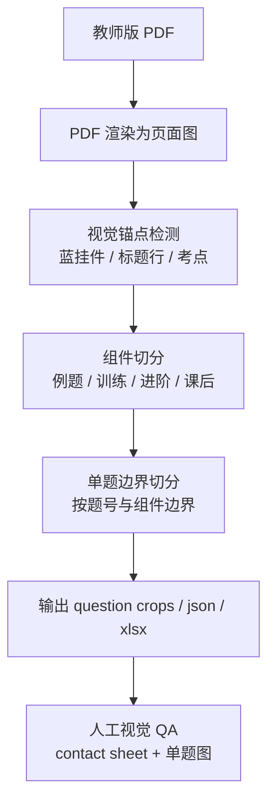
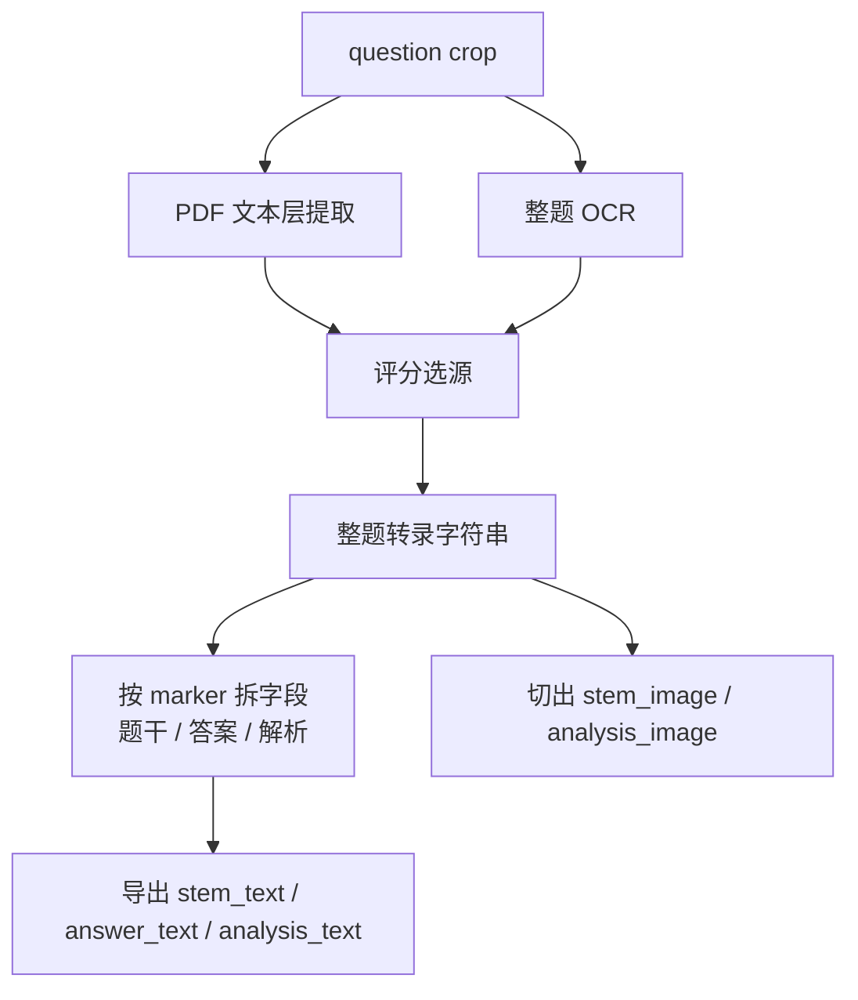
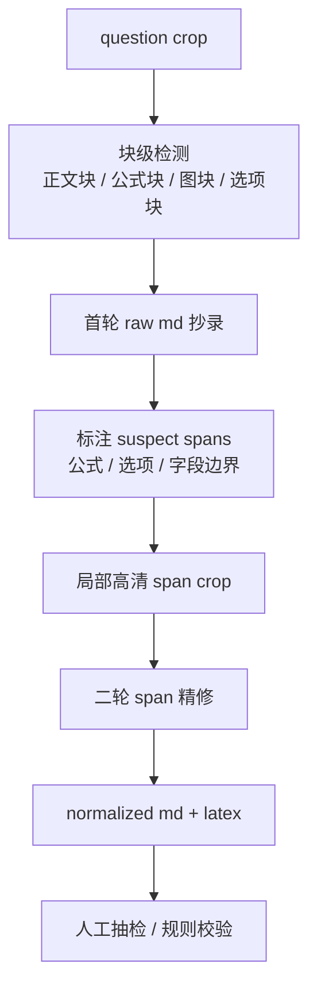

# 视觉流程可视化与人工转录示范 v0.1

日期：2026-06-24

## 1. 现有流程可视化

### 1.1 基准 skill 流程



### 1.2 现行 runtime 流程



### 1.3 当前最大问题点


### 1.4 我建议的目标流程



## 2. 人工视觉转录示范

说明：

- 本节不是走现有 runtime 文本结果。
- 本节是我直接对着题图做人工视觉抄录。
- 每题给两版：
  - `Pass 1`：首轮 raw md
  - `Pass 2`：基于 suspect span 的二次精修 md + LaTeX

---

## 2.1 高中数学 `tq_002`

原题图：

- [tq_002_考点1：正余弦定理及其应用_例题讲解_Q2.png](/C:/Users/EDY/Documents/教研基建/outputs/ingress_splitter_v0.1/codex_profile_senior_math_transcription_v03_20260624/question_crops/tq_002_考点1：正余弦定理及其应用_例题讲解_Q2.png)

关键 span：

- 答案分式：[q2_answer_fraction.png](/C:/Users/EDY/Documents/教研基建/tmp/manual_transcription_spans/q2_answer_fraction.png)
- 解析公式：[q2_analysis_formula.png](/C:/Users/EDY/Documents/教研基建/tmp/manual_transcription_spans/q2_analysis_formula.png)

### Pass 1: raw md

```md
2.（2023·全国）在△ABC中，A = 2B，a = 6，b = 4，则 cos B = ____。

【答案】3/4

【解析】解：在△ABC中，A = 2B，a = 6，b = 4，
则 a/sin A = b/sin B，
即 6/sin 2B = 4/sin B，解得 cos B = 3/4。
故答案为：3/4。
```

### Suspect spans

- `sp_q2_01`: `3/4` 是否为标准分式
- `sp_q2_02`: `a/sin A = b/sin B`
- `sp_q2_03`: `6/sin 2B = 4/sin B`

### Pass 2: refined md + LaTeX

```md
2.（2023·全国）在 $\triangle ABC$ 中，$A = 2B$，$a = 6$，$b = 4$，则 $\cos B = \underline{\hspace{1.5em}}$。

**答案**：$\dfrac{3}{4}$

**解析**：

由正弦定理，

$$
\frac{a}{\sin A}=\frac{b}{\sin B}
$$

代入 $A=2B,\ a=6,\ b=4$，得

$$
\frac{6}{\sin 2B}=\frac{4}{\sin B}
$$

又因为

$$
\sin 2B = 2\sin B\cos B
$$

所以

$$
\frac{6}{2\sin B\cos B}=\frac{4}{\sin B}
$$

解得

$$
\cos B=\frac{3}{4}
$$

故答案为 $\dfrac{3}{4}$。
```

---

## 2.2 高中数学 `tq_003`

原题图：

- [tq_003_考点1：正余弦定理及其应用_例题讲解_Q3.png](/C:/Users/EDY/Documents/教研基建/outputs/ingress_splitter_v0.1/codex_profile_senior_math_transcription_v03_20260624/question_crops/tq_003_考点1：正余弦定理及其应用_例题讲解_Q3.png)

关键 span：

- 题干分式：[q3_stem_formula.png](/C:/Users/EDY/Documents/教研基建/tmp/manual_transcription_spans/q3_stem_formula.png)
- 解析末段公式：[q3_bottom_formula.png](/C:/Users/EDY/Documents/教研基建/tmp/manual_transcription_spans/q3_bottom_formula.png)

### Pass 1: raw md

```md
3.（2020·新课标Ⅲ）在△ABC中，[[sp1: cos C = 2/3]]，AC = 4，BC = 3，则 tan B =（ ）

A. √5
B. 2√5
C. 4√5
D. 8√5

【答案】C

【解析】解：∵ [[sp2: cos C = 2/3]]，AC = 4，BC = 3，
∴ [[sp3: tan C = √(1/cos²C - 1) = √5/2]]，
∴ AB = √(AC² + BC² - 2AC·BC·cos C)
      = √(4² + 3² - 2×4×3×2/3) = 3，可得 A = C，
∴ B = π - 2C，
则 [[sp4: tan B = tan(π - 2C) = -tan 2C = (-2×√5/2)/(1 - 5/4) = 4√5]]。
故选：C。
```

### Pass 2: refined md + LaTeX

```md
3.（2020·新课标Ⅲ）在 $\triangle ABC$ 中，$\cos C = \dfrac{2}{3}$，$AC = 4$，$BC = 3$，则 $\tan B = ( \ )$。

A. $\sqrt{5}$

B. $2\sqrt{5}$

C. $4\sqrt{5}$

D. $8\sqrt{5}$

**答案**：C

**解析**：

因为

$$
\cos C=\frac{2}{3},\quad AC=4,\quad BC=3
$$

所以

$$
\tan C=\sqrt{\frac{1}{\cos^2 C}-1}
=\sqrt{\frac{1}{\left(\frac{2}{3}\right)^2}-1}
=\frac{\sqrt{5}}{2}
$$

又由余弦定理，

$$
AB=\sqrt{AC^2+BC^2-2AC\cdot BC\cdot \cos C}
$$

代入得

$$
AB=\sqrt{4^2+3^2-2\times 4\times 3\times \frac{2}{3}}=3
$$

所以 $AB=BC$，可得 $A=C$。

于是

$$
B=\pi-2C
$$

从而

$$
\tan B=\tan(\pi-2C)=-\tan 2C
=\frac{-2\tan C}{1-\tan^2 C}
=\frac{-2\times \frac{\sqrt{5}}{2}}{1-\frac{5}{4}}
=4\sqrt{5}
$$

故选 C。
```

---

## 2.3 初中几何 `tq_002`

原题图：

- [tq_002_考点1_倍长中线与中位线_强化训练_Q变式1-1.png](/C:/Users/EDY/Documents/教研基建/outputs/ingress_splitter_v0.1/codex_profile_junior_geometry_transcription_v02_20260624/question_crops/tq_002_考点1_倍长中线与中位线_强化训练_Q变式1-1.png)

关键 span：

- 选项块：[jq2_options_block.png](/C:/Users/EDY/Documents/教研基建/tmp/manual_transcription_spans/jq2_options_block.png)
- 答案/解析边界：[jq2_answer_line.png](/C:/Users/EDY/Documents/教研基建/tmp/manual_transcription_spans/jq2_answer_line.png)

### Pass 1: raw md

```md
【变式1-1】
（2024 秋·天门期末）

如图，AD 是△ABC 的边 BC 上的中线，若 AB = 5，AD = 3，则 AC 的取值范围为（ ）

A. 1 < AC < 11
B. 1 < AC < 8
C. 2 < AC < 8
D. 1 < AC < 4

【答案】A

【解析】解：延长 AD 到点 E，使 ED = AD，连接 EB。
∵ AD 是△ABC 的边 BC 上的中线，
∴ BD = CD。
在△EBD 和△ACD 中，
ED = AD，
∠EBD = ∠ADC，
BD = CD，
∴ △EBD ≌ △ACD（SAS），
∴ EB = AC。
∵ AB = 5，AD = 3，
∴ AE = 2AD = 6。
∴ AE - AB < EB < AE + AB，
且 AE - AB = 6 - 5 = 1，AE + AB = 6 + 5 = 11，
∴ 1 < AC < 11。
故选：A。
```

### Suspect spans

- `sp_jq2_01`: 四个选项的左右顺序
- `sp_jq2_02`: `∠EBD = ∠ADC` 是否抄对
- `sp_jq2_03`: 最终不等式链是否完整

### Pass 2: refined md + LaTeX

```md
## 变式 1-1

（2024 秋·天门期末）

如图，$AD$ 是 $\triangle ABC$ 的边 $BC$ 上的中线，若 $AB=5,\ AD=3$，则 $AC$ 的取值范围为（ ）

A. $1<AC<11$

B. $1<AC<8$

C. $2<AC<8$

D. $1<AC<4$

**答案**：A

**解析**：

延长 $AD$ 到点 $E$，使 $ED=AD$，连接 $EB$。

因为 $AD$ 是 $\triangle ABC$ 的边 $BC$ 上的中线，

所以

$$
BD=CD
$$

在 $\triangle EBD$ 和 $\triangle ACD$ 中，

$$
ED=AD,\quad \angle EBD=\angle ADC,\quad BD=CD
$$

所以

$$
\triangle EBD \cong \triangle ACD \quad (SAS)
$$

从而

$$
EB=AC
$$

又因为

$$
AB=5,\quad AD=3
$$

所以

$$
AE=2AD=6
$$

在 $\triangle ABE$ 中，由三角形三边关系得

$$
AE-AB<EB<AE+AB
$$

即

$$
6-5<EB<6+5
$$

所以

$$
1<EB<11
$$

又因为 $EB=AC$，故

$$
1<AC<11
$$

故选 A。
```

## 3. 这次示范的结论

1. 旗舰模型直接看整题图，做 `Pass 1 raw md` 是可行的，尤其是结构和字段边界比当前 runtime 稳。
2. 对公式题，真正的提升来自 `Pass 2 span 精修`，尤其是分式、平方、根号、二倍角公式这些位置。
3. 但这仍然是人工级示范，不等于可以直接批量化替代 runtime。
4. 如果产品要落地，第一遍应该产出 `raw md + suspect spans`，第二遍只修 `suspect spans`，不要整题重跑。
