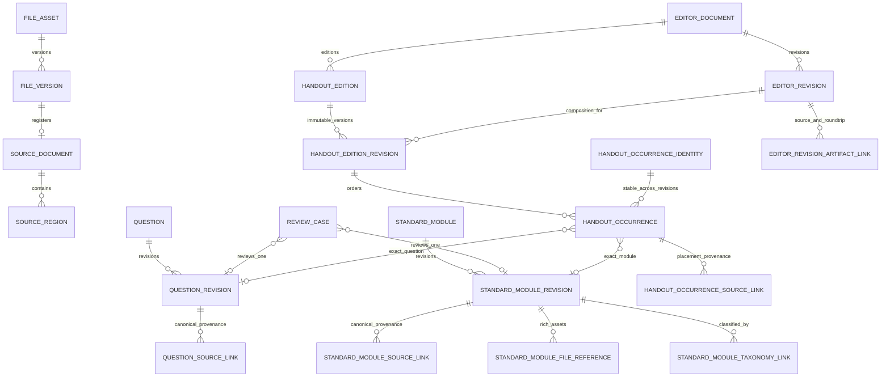

# G4 Handout Content Asset & Composition Foundation 设计审计

状态：`G4_DESIGN_APPROVED_FOR_IMPLEMENTATION`

基线：`integration/repository-scope-clean-20260715@61fd6438d944484bf6d07bb0fed5ed71e055f8ab`

范围：所有学科共用的讲义内容资产与编排基础，不是英语特判。

## 1. 结论

当前 V001-V008 已经具备文件、来源、题目、审核、taxonomy、不可变编辑器修订、WP-01 working draft、preview、snapshot 和 export 底座。G4 不需要推倒重建，但必须补齐三个缺口：

1. `standard_module` 必须成为与 `question` 同级的一等内容资产；taxonomy 只能分类，不能保存模块正文。
2. `question_source_link` 必须允许一个不可变题目修订关联多条 canonical provenance；讲义中的一次出现还必须拥有独立的 placement provenance。
3. 正式讲义不能永久只藏在匿名 `master_doc_json` 中，需要一个绑定精确 `editor_revision_id` 的统一、不可变、有序 composition。

以上决策与现有产品事实没有冲突，可以进入 G4 实现。主知识点唯一性规则仍由 `BLOCKS_TAG_SCHEMA_AND_SEARCH` 阻塞，本轮不决定旧主标签降级或删除。

## 2. 十个问题的明确答案

### 2.1 standard_module 是否是一等资产

是。`standard_module` 是稳定身份，`standard_module_revision` 是不可变内容。它可以独立审核、被 taxonomy 分类、关联来源与文件，并被多份讲义和同一讲义的多个 occurrence 引用。

章节、题组、分页占位等仅用于组织讲义，它们是 composition container 或 ordinary content，不会被伪装成 standard module。

### 2.2 身份、revision、批准与审核

- `standard_module(module_id, workspace_id, module_key)` 保存稳定身份和生命周期状态。
- `standard_module_revision(module_revision_id, module_id, revision_no, content_hash, content_json)` 保存不可变内容。
- `standard_module.approved_revision_id` 只指向通过 Review 的精确 revision。
- Review Case 扩展为明确的 `target_type=question|standard_module`；一个 case 只引用一种精确 revision，决定不修改 revision 内容。
- 模块内容相同且 hash 相同的重试复用现有 revision，不制造假版本。

### 2.3 taxonomy、source region、file/version

- taxonomy：`standard_module_taxonomy_link` 指向精确 module revision 与精确 taxonomy node/version。
- canonical provenance：`standard_module_source_link` 允许一个 module revision 有多条来源证据。
- 富媒体：`standard_module_file_reference` 指向精确 `file_version_id`，角色例如 image、table-source、attachment。
- source region 只定位证据；文件字节、媒体类型与 hash 继续由 `file_asset/file_version` 承担。

### 2.4 question_source_link 一题一来源

删除 `unique(question_revision_id)`，增加稳定 `source_evidence_key`，唯一范围为：

```text
(question_revision_id, source_evidence_key)
```

旧行获得可重复执行的 legacy key。新调用方必须显式提交 evidence key；同一证据重试幂等，不同 source region 可以并存。禁止用制造新 Question Revision 的方式绕开来源约束。

### 2.5 两层 provenance

必须分开：

- **Question Revision canonical provenance**：说明这道题作为资产从哪里来，保存在 `question_source_link`。
- **Handout occurrence placement provenance**：说明这次在某份讲义的某个位置出现时，对应教师版或学生版原件的哪个 source region，保存在 `handout_occurrence_source_link`。

同一题可在多处出现，每次 occurrence 可有不同 placement provenance，但都引用同一个 question revision。

### 2.6 统一 composition

`editor_document` 继续作为讲义稳定身份，`editor_revision` 继续作为不可变讲义版本。G4 增加：

- `handout_edition`：teacher canonical 或 student projection；
- `handout_edition_revision`：精确绑定 editor revision 的不可变 edition；
- `handout_occurrence_identity`：同一 editor document 内稳定 occurrence key；
- `handout_occurrence`：某一 edition revision 中的父级、顺序、内容类型和精确引用；
- `handout_occurrence_source_link`：某一次落位的来源证据；
- `editor_revision_artifact_link`：原件、manifest、preservation/roundtrip bundle 的强引用。

`handout_occurrence.kind` 仅允许：`container`、`question`、`standard_module`、`ordinary_content`。每行必须且只能携带对应类型需要的引用或本地 JSON。

### 2.7 occurrence 不变量

- `occurrence_key` 在一份 editor document 内稳定；跨 revision 可以复用同一 identity。
- parent、order、标题、local content 和引用目标都保存在不可变 occurrence 行，不可挂在 stable identity 上可变更新。
- 同一 edition revision 内 `(parent, position_index)` 唯一。
- 同一 asset revision 可被多个 occurrence 引用，不设置 target 唯一约束。
- parent 必须属于同一 edition revision；数据库组合外键阻止跨 workspace、跨版本拼接。

### 2.8 教师版 canonical 与学生版

教师版是 canonical edition。学生版是一个精确指向 teacher edition revision 的 projection：

```text
projection_rules_json + delta_json + projection_content_hash
```

学生版 occurrence 仍可拥有独立原件位置证据，但共享题目和模块 revision。题干、答案隐藏、挖空等差异由可审计 delta 表达，不复制第二套题库。snapshot 仍固定精确 `editor_revision_id` 和 audience；G4 不改变既有 snapshot/export 合同。

### 2.9 editor_revision 强引用

`editor_revision_artifact_link` 绑定：

- `original_docx`：原始 DOCX 对应的精确 file version/source document；
- `split_manifest`：拆分 manifest 的精确 file version；
- `preservation_bundle`：保真包的精确 file version；
- `roundtrip_output`：重组验证输出的精确 file version。

链接保存 role、artifact key、hash 和 metadata；数据库外键保证 workspace 一致。路径只允许由 `file_version.storage_key` 表达，不保存本机绝对路径。

### 2.10 富内容与导出

这是两个独立 Gate：

- **存储 Gate**：JSON 结构、文件引用、source region、hash、顺序和版本可持久化并读回。
- **导出 Gate**：DOCX/PDF/HTML 适配器能正确还原表格、图片、公式、分页和字体。

数据库能存表格 JSON 或图片引用，不等于导出已经通过；导出通过也不能替代 provenance 和 revision 完整性。

## 3. 领域关系图



## 4. Migration 变更清单

G4 使用纯追加 `V009__handout_content_asset_and_composition.sql`：

1. 修正 `question_source_link` 多来源幂等约束。
2. 增加 `standard_module`、`standard_module_revision`、source/file/taxonomy links。
3. 以向后兼容方式扩展 `review_case`，原 question Review API 不变。
4. 增加 edition、edition revision、occurrence identity、occurrence、occurrence source link。
5. 增加 editor revision artifact link。
6. 增加组合外键、workspace 隔离、不可变 trigger 和查询索引。

V009 不更新 `editor_revision.master_doc_json`，不重写历史 question/editor revision，不更改 snapshot/export，不复制旧 editor，也不创建 knowledge document/question group/search 表。

## 5. Java 变更清单

- `standardmodule`：module/revision 创建、精确读取、批准指针、反查、source/file link。
- `review`：新增 module review 入口并按 target type 分派；原 question API 保持兼容。
- `taxonomy`：新增 module revision assignment；主标签业务规则仍开放。
- `question`：`QuestionSourceEvidenceCommand` 增加 evidence key；repository 允许多来源。
- `editor::api`：暴露 workspace-scoped exact revision directory。
- file/source 强引用：复用既有表与 workspace 组合外键校验，不新增第二套文件或来源目录。
- `handout`：edition/composition repository、service、API；只接收精确 immutable revision 引用。

所有新增或修改 Java 文件包含中文维护注释。模块间只通过 `::api` 依赖，继续由 Spring Modulith 边界测试约束。

## 6. 迁移兼容与 WP-01

- 现有 V001-V008 数据原样保留；V009 可以从空库或 V008 升级。
- 旧 `question_source_link` 行 backfill 稳定 evidence key；重复执行不会产生第二条。
- 没有 composition 的旧 editor revision 仍按 `master_doc_json` 读取；首次显式迁移才写 G4 composition。
- WP-01 autosave 仍只更新 `editor_working_draft`，不会因 G4 创建永久 revision。
- preview confirmation 仍先冻结/复用 exactly-one editor revision；G4 composition 只绑定这个精确 revision。
- rollback 采用停用 G4 入口并保留追加表的前向兼容策略；V009 后不得回退到只理解旧来源唯一键的 writer。历史 editor、working draft、snapshot/export 都无需逆向改写。

## 7. 风险

1. **跨版本 occurrence identity 误复用**：service 校验 identity 归属同一 editor document，parent 使用 edition-revision scoped FK。
2. **同内容并发创建 module revision**：module row lock + `(module_id, content_hash)` 唯一约束。
3. **Review target 二选一**：数据库 check 保证 question/module 恰好一个。
4. **student delta 漂移**：每个 projection 固定 canonical teacher edition revision 与 hash。
5. **大 composition 写放大**：occurrence 分行存储，避免每次修改复制一个巨型 JSON；正式保存仍跟随 immutable editor revision 事件。
6. **source evidence 爆量**：按 target/region 建索引；evidence payload 只放定位元数据，二进制留在 file version。
7. **富内容误报完成**：存储与 renderer acceptance 分开出结果。

## 8. Golden Acceptance Contract

### A. 圆讲义

- 现有题目 identity/revision、Review、taxonomy、WP-01 working draft、preview、snapshot/export hash 不变。
- 新 composition 可引用既有题目 revision；同一题重复 occurrence 不复制 Question。
- 旧 API 和既有回归 Gate 全绿。

### B. 《时态语态秘密武器》

以真实 V1 保真样本的结构清单生成仓库内稳定、无绝对路径的测试 fixture，并验证：

- 3 个 standard module 拥有稳定 identity、不可变 revision、Review、taxonomy/source link 与 usage back-reference。
- 63 个 question occurrence 可去重指向较少的 question revision，同一 revision 可出现多次。
- occurrence 保存自己的 source region；canonical question provenance 不被 placement 覆盖。
- teacher/student 共享 Question，student 通过 pinned teacher revision + projection/delta 生成。
- 439 个 source block 恰好被 module/question/ordinary occurrence 覆盖，无遗漏、无重复。
- 3 个 standard module 与 4 个 question container 类型严格不同。
- teacher canonical composition 可按 parent/order 完整重组。
- 4 个表格和 9 次图片引用分别通过存储 Gate；renderer Gate 单独报告。
- original DOCX -> source/manifest -> asset/revision/occurrence -> reconstructed output 全链可审计。
- WP-01 的 100 autosave、幂等、并发 409、checkpoint、preview/snapshot 测试继续通过。

测试 fixture 只携带结构、稳定逻辑 key、相对 artifact key 和已知 hash，不把开发机目录当作输入合同。

## 9. 范围边界

### G4 实施

- 多来源 provenance；
- standard module 资产与 revision；
- module Review/taxonomy/source/file relations；
- handout edition/composition/occurrence；
- teacher canonical + student projection/delta；
- editor revision artifact strong links；
- Java API/repository/service；
- V009、migration、模块边界与 Golden gates。

### 延后

- 统一 Import Contract；
- Release Seed 扩展和批量讲义灌库；
- 风险自动放行；
- standard module 搜索、统一搜索、推荐、AI 生成；
- knowledge document、question group 正式实现；
- 主标签替换业务规则；
- OIDC/完整 ACL；
- 四条生产链内部改造；
- renderer 的新功能开发和生产容量压测。

## 10. 实施判定

没有发现必须由产品负责人先裁决的冲突。采用增量、可回滚、精确 revision 引用方案进入 G4；任何无法保持 V001-V008 兼容或需要扩大 Release Seed/Import Contract 的问题都应 fail closed，并报告为 G4 blocker。
