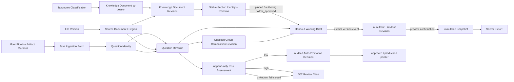

# TeachBase Phase 0 Contract Package

> 状态：Phase 0 核心合同部分就绪；当前正式工作包为 WP-01
>
> 日期：2026-09-02
>
> 范围：common 名称修复、四份 ADR、三个隔离 schema spike、Gate 重分级

## 1. 冻结事实

本包直接采用用户已冻结的七项产品事实，不再将其列为 unknown：知识文档按讲次；三版本 key 与“常用版”展示名；low/high/unknown 风险分流；local block 默认不是 module；全局搜索含 question/group；发布固定精确 revision；旧引用不自动升级。

## 2. Common 名称修复

规范合同：

```text
key: basic    display: 基础版
key: common   display: 常用版
key: advanced display: 进阶版
```

- `EditorVariantContract` 是唯一 key/display/legacy alias 合同。
- 新写入的 `targetLayers` 只保存 key。
- projector 读取 `basic/common/advanced`，同时兼容历史“常用版”和“常规版”。
- `editor_variant.display_name` 的 common 标准展示为“常用版”，不参与业务判断。
- master-overrides-v1 既有数组顺序保持 `basic/advanced/common`，本轮不做破坏性重排。

回归证据：

- unit：canonical key、常用版、常规版投影一致；validator 将历史中文输入规范成 key。
- editor live：新 revision targetLayers 落 key；直接模拟未迁移旧 revision；common snapshot 同时包含两种旧称内容；variant 展示名为常用版；export admission 幂等。
- question collection live：题目落位 API 只持久化 key，common snapshot 固定题目内容。
- renderer live：canonical common key 经过 snapshot，实际输出 HTML/MathML、DOCX/OMML 与 PDF，并验证失败清理。

## 3. 四份 ADR

| ADR | 决定 |
| --- | --- |
| ADR-01 | autosave 更新 mutable draft；checkpoint 短期恢复；明确事件才建 immutable revision；snapshot 固定精确 revision |
| ADR-02 | lesson-bound knowledge document；稳定 section identity + lineage；四种引用模式分阶段受控 |
| ADR-03 | stable question group + immutable composition revision，不复制 question content |
| ADR-04 | import retry、question identity、revision dedup 三套独立规则；low 自动决定、high/unknown 进 S02 |

## 4. 修正后的领域关系图



Review Case 与 Auto-Promotion Decision 均引用精确 `question_revision_id`。风险评估和风险决定只能追加状态事实，不得创建或修改 revision 内容。

standard module 和统一搜索只保留未来连接位置，本轮没有建表或实现。

## 5. Schema Spike

三个 DDL 只创建 `teachbase_phase0_spike`：

- `editor_working_draft` + `editor_draft_checkpoint`；
- `knowledge_document` + revision + stable section + lineage；
- `question_group` + immutable composition revision + exact revision items。

详细复用、迁移、回滚、样例、并发测试和未解决问题见 `docs/architecture/spikes/README.md`。这些文件不是生产迁移，不能直接复制为 V008。

## 6. Gate 重新分级

### BLOCKS_SCHEMA_AND_CODING

仅阻塞生产 DDL 或对应业务编码，不阻塞文档/spike：

| Gate | 当前状态 |
| --- | --- |
| common key/display/legacy 合同 | CLOSED，本轮修复和回归覆盖 |
| working draft/revision/snapshot 合同 | CLOSED，ADR-01 |
| knowledge document/section/reference 合同 | CLOSED，ADR-02 |
| question group composition 合同 | CLOSED，ADR-03 |
| ingestion 三类 identity/dedup 合同 | CLOSED，ADR-04 |
| spike 约束可运行 | CLOSED，隔离 PostgreSQL gate 通过 |

结论：第一个正式工作包可以启动。OIDC 供应商、完整容量压测和模型日志政策不属于这一类 Gate。

### BLOCKS_TAG_SCHEMA_AND_SEARCH

- 二审 P0-06 尚未关闭：同一 `question_revision` 在同一 taxonomy 维度最多一个 primary。
- 本 Gate 不阻塞 WP-01。
- 它阻塞后续标签维护、standard module taxonomy link 和统一搜索正式 schema。
- “副标签升级为主标签后，旧主标签降级还是删除”仍是待定产品决定，本轮不擅自选择。

### BLOCKS_MULTI_USER_TRIAL

- 可信 authenticated actor，客户端不能自报任意 user ID；可先使用内部认证 adapter，不要求本轮选择最终 OIDC 供应商。
- working draft 正式迁移、双读/回滚和并发 409 集成测试完成。
- workspace role 与 private/workspace ACL 在试用 API 上生效。
- 数据库备份、最小恢复演练和错误审计可用。
- common 完整 live gates 通过。

### BLOCKS_PRODUCTION_RELEASE

- 最终身份供应商/OIDC、服务账号和密钥轮换落地。
- 四链各一包通过 Java ingestion batch，low/high/unknown 风险转换有审计证据。
- 目标数据量下的 autosave/search/export/OCR 分层容量与恢复压测。
- 模型供应商正文、密钥、日志留存和脱敏政策落实。
- renderer/enrichment worker 与 Web 隔离，监控、告警、备份恢复和 projection 重建演练完成。
- 生产迁移经过 expand/backfill/switch/contract 审批；不得直接使用 spike SQL。

## 7. 当前允许启动的第一个正式工作包

### WP-01 Editor Working Draft Separation

范围严格限定为 ADR-01：

1. 将 working draft/checkpoint spike 整理为正式追加迁移候选；
2. 新增 repository/service/API 的 optimistic draft version；
3. 从旧 `editor_draft` 懒迁移/批量 backfill；
4. autosave 不再创建永久 revision；
5. preview confirmation 必要时冻结 revision，snapshot/export 合同不变；
6. 完成双读、冲突、checkpoint retention、旧 snapshot export 和回滚 gate。

明确不包含：standard module、统一搜索、OIDC 供应商集成、四链内部修改、knowledge document 正式实现、question group 正式实现。

## 8. 状态

本轮产品事实已接收，common 缺陷已修，四份核心合同已冻结，三个隔离 spike 可执行；这些证据只允许启动 WP-01，不代表标签、认证、模块 schema、搜索 schema 或生产容量全部关闭。

`PHASE0_CORE_CONTRACT_PARTIAL_READY`
