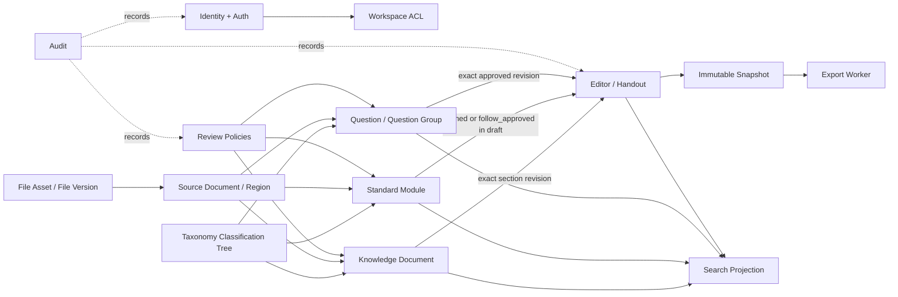
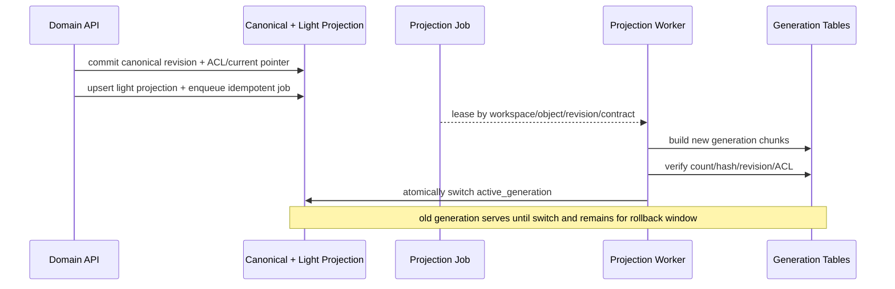

# TeachBase 教学资产与搜索基础设施二次架构审计

> 审计日期：2026-09-02
>
> 审计性质：只读二次审计；本文件之外未修改业务代码、迁移、配置、测试或四条生产链
>
> 审计结论：`GO_WITH_BLOCKING_GATES`

## 1. Repository Baseline

### 1.1 基线与漂移

| 项目 | 结果 |
| --- | --- |
| 当前分支 | `backend/java-modulith-foundation-survey` |
| 提示词指定基线 | `d68828c334fa8a275effccc59e4c2ef9c060d5ef` |
| 审计开始时 HEAD | `842f67d0f88190d3120d820689d08e4aaa54116e` |
| 漂移范围 | 仅新增 `docs/backend/content-asset-search-audit-and-plan.md`，810 行 |
| 业务代码、DDL、配置漂移 | 无 |
| 审计开始时工作区 | clean |

因此，本报告对业务实现的判断同时适用于指定基线 `d68828c` 与当前 HEAD `842f67d`；对原讨论稿的判断针对当前 HEAD 中新增的讨论稿。不能把讨论稿中的目标表、搜索模块或标准模块误写为已经落地。

### 1.2 检查范围

- Flyway `V001` 至 `V007`，共 41 张应用表。
- Spring Modulith 的 `identity`、`fileasset`、`source`、`question`、`taxonomy`、`editor`、`collection`、`review`、`audit`、`exporting`、`releaseseed`、`migration` 模块。
- Controller、请求 DTO、应用服务、jOOQ repository、模块公开端口和模块边界测试。
- 编辑器草稿、revision、三版本投影、预览确认、不可变 snapshot 与导出 worker。
- 题目导入、搜索、父子关系、来源证据、审核、知识点关联和 Release Seed 导入。
- 文件哈希去重、来源区域、worker 租约、重试、心跳、临时文件与原子产物合同。
- 四条生产链目录中对 PostgreSQL/JDBC/ORM/规范表直写的静态检索。
- 已提交的机器报告：Java Foundation、Question Collection、Document Renderer。
- 原讨论稿 `docs/backend/content-asset-search-audit-and-plan.md` 全文。

### 1.3 运行过的检查

```text
git status --short --branch
git rev-parse HEAD
git diff --stat d68828c..HEAD
git diff --name-status d68828c..HEAD
rg / Get-Content 对 DDL、Java、测试、package scripts 和机器报告的定向检查
四条生产链目录的数据库客户端、ORM 和规范表 DML 静态扫描
npm run test:java-foundation-survey
npm run test:java-comment-contract
npm run build:java-foundation
```

三项现有门禁均通过：Java foundation survey 返回 `ok=true`；207/207 个 Java 文件满足中文维护注释合同；Maven `clean package` 成功。survey 同时报告遗留表 43/43 已映射、原型绝对路径债务 77 项；后者属于既有迁移债务，不应被误写成已经清零。

本轮没有对 240 条样本数据库运行新的 `EXPLAIN (ANALYZE, BUFFERS)`。240 条数据无法提供有意义的容量结论；将它包装成“已验证性能”反而会误导实施。第 7 节列出了可执行的压测数据规模和查询集合。

### 1.4 无法从仓库确认的部分

- 高危/低危的业务定义、判定主体和生产放行规则。
- 四条生产链当前真实部署实例是否另有仓库外直写数据库脚本。仓库内静态扫描未发现，不代表外部部署绝不存在。
- 前端最终自动保存频率、三版本中文产品名、模块共享审核策略和管理员查看私人草稿的规则。
- 实际生产对象量、文本平均字节数、编辑活跃占空比、峰值搜索 QPS、OCR/模型耗时和 PDF 单任务内存。

## 2. Executive Verdict

### 2.1 总结判定

**`GO_WITH_BLOCKING_GATES`**

现有后端不是需要推倒重建的废墟。它已经有一组质量不错的承重结构：工作区组合外键、不可变文件版本、题目稳定身份与 revision、审核通过指针、不可变讲义 snapshot、PostgreSQL 租约队列、原子导出、来源证据和审计端口。

但它还不是完整的“教学资产平台”。当前更像一栋已经建好文件库、题库、讲义间和出货通道的厂房，标准模块库、知识文档库、统一检索台、门禁系统和生产链收货口仍未建成。最危险的不是少几张表，而是在边界未冻结前直接开工：本地 block 会被误当共享资产，自动保存会制造海量永久 revision，客户端自报用户会穿透权限，知识分类树会被迫承担它不擅长的有序内容文档职责。

### 2.2 评分与证据

| 维度 | 评分 | 证据化说明 |
| --- | ---: | --- |
| 现有底座成熟度 | 7/10 | 41 张表、显式 Modulith 边界、稳定对象/revision、组合外键、租约 worker 和多项 live gate 已存在；认证、统一搜索、模块和知识文档缺失 |
| 目标架构方向成熟度 | 7/10 | “规范真相 + 可重建投影 + 异步语义补全 + PostgreSQL-first”方向正确；原计划对知识文档、block/module 边界、working draft、题组和重建原子切换描述不足 |
| 直接开工完备度 | 3/10 | 至少 7 个阻塞合同未冻结：认证身份、知识文档对象、block/module、revision、风险放行、三版本命名、主标签唯一性 |
| 完整 TeachBase 闭环覆盖度 | 5/10 | 文件、题目、讲义、审核、快照、导出已成局部闭环；标准模块、知识文档、统一搜索、四链正式 ingestion 和权限闭环未实现 |

- **最大工程风险**：在对象边界不清时先建标准模块和搜索投影，之后被迫同时重写 canonical 表、引用和索引。
- **最大用户体验风险**：高频自动保存每次创建不可变 revision，加上“常用版/常规版”标签不一致，可能表现为保存冲突、历史膨胀和内容在某版本中消失。
- **最大资源风险**：把长文档切块、引用展开、OCR 和模型任务放进 Web 同事务或同进程，会同时吃满数据库连接、CPU、内存和请求时延。

## 3. AS-IS Capability Matrix

状态定义：`VERIFIED_AS_IS` 表示数据库、Java 合同和测试证据三者完整；`PARTIAL` 表示至少缺一项；`PROPOSED_ONLY` 表示只在讨论稿出现；`UNKNOWN` 表示业务或运行证据不足。

| 领域 | VERIFIED_AS_IS | PARTIAL | PROPOSED_ONLY | UNKNOWN | 证据 |
| --- | --- | --- | --- | --- | --- |
| identity |  | app_user、成员、角色、教学范围 | Spring Security/OIDC | 正式身份供应方 | V001/V007；请求仍收 `actorUserId` |
| workspace | 租户表、成员状态、组合外键门禁 | 角色授权粒度未普遍执行 |  | 管理员私人内容权限 | V001；各应用服务 active-member 检查 |
| file | 不可变 file_version、工作区哈希幂等、便携 storage key | 归档 API、版权/派生关系 |  | 物理删除保留期 | V001；FileRegistrationService；phase1 live gate |
| source | source_document、source_region、页码/bbox/来源引用 | OCR 原文/人工修正/模型描述未分栏 | 派生图像关系 | 版权状态合同 | V001；ReleaseSeedSourceProcessor |
| question | 稳定 identity、不可变 revision、approved pointer、来源 | 相关性搜索和结构化标签查询不足 | 统一 SearchGateway | 低危自动放行 | V004/V005；QuestionService/Repository |
| question group | 稳定题目间 child/variant/related 边 | 关系未固定 revision；搜索和放置不聚合题组 | 独立 question_group 投影 | 父题升级策略 | question_relation；Projector 的 legacy children 逻辑 |
| taxonomy | 版本化分类树、别名、唯一 active version | 仅精确解析；主标签维度唯一性缺失 | 模糊检索/迁移任务 | 主标签替换语义 | V005；TaxonomyService |
| knowledge document |  |  | 独立 knowledge_document 领域 | 最终产品定义 | 当前 document_kind 仅两类讲义/题包 |
| standard module |  | 编辑器 JSON 可承载内容但无资产身份 | 完整 module 领域、revision、审核、搜索 | 共享审核政策 | 仓库无 module 表/包/API |
| editor/handout | 三变体、不可变 revision、乐观冲突、snapshot | 每次保存生 revision；版本中文名冲突 | 可变 working draft | 自动保存频率/保留期 | V002；JooqEditorDocumentRepository |
| review | 题目 case、冻结 hash、串行 terminal decision | 仅题目；无风险判定对象 | 模块审核 | 高危分流原则与当前实现冲突 | V005；ReviewService |
| search |  | 题目 contains/trigram/FTS 索引、时间游标 | 统一投影、chunk、重建 job | 目标相关性与 SLA | V004；JooqQuestionRepository |
| jobs | 导出 worker 租约、心跳、重试、回收 | Release Seed 状态较窄；无通用投影/加工任务 | search/enrichment jobs | 实际 OCR/模型并发 | V003/V006；ExportWorker |
| audit | 业务 audit_event 与应用端口 | 无统一敏感正文脱敏策略证据 | 搜索行为审计 | 日志供应商保留规则 | V001；JooqAuditTrail |
| export | snapshot-bound、幂等、租约、原子文件、失败清理 | 与 Web 同 deployable，生产资源隔离未落地 | 独立 worker profile | 生产字体/内存预算 | renderer live gate |
| ingestion | Release Seed 通过公开领域端口、幂等包 hash | 尚未成为四链正式收货合同 | artifact manifest/inbox API | 仓库外部署是否直写 | V006；releaseseed package-info |

## 4. Findings

### P0-01 正式认证尚未建立，客户端可以自报 actor

- **结论**：工作区成员校验存在，但身份来源不可信，不能用于正式生产授权。
- **状态**：verified
- **代码与数据库证据**：V001 有用户、成员与角色；Controller 请求体/查询参数直接接收 `actorUserId`；`pom.xml` 无 Spring Security/OIDC 依赖；应用服务只验证该 UUID 是 active member。
- **用户影响**：知道其他成员 UUID 的客户端可冒用其身份执行保存、导入、审核或导出。
- **数据完整性影响**：审计事件的 actor 可能是伪造值。
- **性能与资源影响**：无直接性能影响，但事后审计和修复代价高。
- **不处理的失败场景**：私人草稿、工作区共享、审核权限和用户教学范围都无法形成可信门禁。
- **最小修正**：接入 Spring Security；actor 只来自认证上下文；API 不再接受 actor 字段；建立角色/资源级授权测试和 SQL 级可见性条件。
- **是否阻塞实施**：阻塞任何 private/workspace 内容和正式试用；不阻塞纯本地 schema spike。

上线级别判定：

| 使用级别 | 当前判定 | 限制 |
| --- | --- | --- |
| 开发演示 | 可用 | 固定测试账号、隔离数据、不可视为真实审计 |
| 内部多人试用 | 不可直接放行 | 至少要有可信登录、authenticated actor 和 workspace ACL |
| 正式生产 | NO-GO | 还需角色/资源授权、敏感日志策略、服务账号和供应商数据边界 |

仓库也没有证明模型供应商的数据使用/保留政策、正文脱敏、业务密钥过滤或管理员越权审计。正式调用模型前必须把供应商 allowlist、最小化 payload、secret redaction、正文日志禁写和 request hash/trace ID 取证写进运行合同；这一点当前属于 `UNKNOWN_OR_AMBIGUOUS`，不能由“模型调用成功”替代。

### P0-02 taxonomy 只是版本化分类树，不是完整知识结构文档

- **结论**：把 taxonomy 扩成“讲次 + section + 多媒体 + 有序引用”的完整知识文档会混淆分类与内容编排。
- **状态**：verified
- **代码与数据库证据**：taxonomy_node 只有 code、name、parent、sort、metadata；无文档稳定身份、section revision、块内容和精确引用。editor_document 仅支持 synchronized_handout/independent_question_pack。
- **用户影响**：知识结构无法按整份、section 或块级稳定引用、升级和搜索。
- **数据完整性影响**：把内容塞进 metadata_json 会失去类型约束和独立 revision。
- **性能与资源影响**：搜索和影响分析需要反复解析任意 JSON。
- **不处理的失败场景**：知识树节点拆分/合并时，旧讲义无法证明引用的是哪个内容版本。
- **最小修正**：新增独立 `knowledge_document` aggregate；复用编辑器结构化内容 schema/validator，但不复用讲义生命周期表。
- **是否阻塞实施**：阻塞知识结构内容和标准模块表的最终冻结。

三种方案比较：

| 方案 | 适配度 | 优点 | 反例/代价 | 判定 |
| --- | --- | --- | --- | --- |
| 新 knowledge_document 领域 | 高 | 生命周期、revision、section identity、审核和搜索独立 | 新增表/API/迁移 | 推荐 |
| 扩展 editor_document 类型 | 中低 | 可复用现有 JSON 和快照 | 被三变体、讲义预览/导出、当前 autosave revision 语义绑死 | 不推荐作为 canonical |
| taxonomy + module 拼装 | 低 | 表面上表少 | 无整份文档 identity/revision；section 顺序和整体引用无真相 | 否决 |

迁移代价不是“新表越少越便宜”。独立领域的初期代价中等，主要是追加根表、revision、section/reference 和 API，但现有 taxonomy/editor 数据无需破坏性搬迁。扩展 editor 表初期看似便宜，后续却要从三变体、预览、导出和 autosave 语义中拆出知识文档，总代价高。taxonomy + module 初期表最少，但会把整份文档版本、section 身份和顺序隐含在拼接逻辑中，数据灌入后修复成本最高。

### P0-03 editor block 与 standard module 的边界未冻结

- **结论**：普通编辑器 block 是讲义局部内容，不应因粘贴或上传自动变成共享资产。
- **状态**：verified
- **代码与数据库证据**：编辑器只保存嵌入式 Tiptap JSON；仓库不存在 standard_module 表、稳定 ID、引用或审核 API。
- **用户影响**：若“粘贴即建模块”，资产库会被标题残片、临时截图和重复表格污染。
- **数据完整性影响**：删除本地 block 可能错误删除共享资产；复制内容与引用资产无法区分。
- **性能与资源影响**：无意义资产和投影量随每次粘贴增长。
- **不处理的失败场景**：一个模块被多份讲义使用后，用户无法判断删除、解除引用、归档分别影响谁。
- **最小修正**：默认只创建本地 block；只有显式“保存为可复用模块”才创建 stable module；引用表固定 revision；删除讲义 block 只解除引用；共享模块只允许归档。
- **是否阻塞实施**：阻塞 module 表和编辑器插入合同。

对象边界：

| 对象 | 稳定身份 | 跨讲义复用 | 独立审核 | 全局搜索 | revision |
| --- | --- | --- | --- | --- | --- |
| editor block | 仅文档内 block ID | 否 | 否 | 默认否 | 随 editor revision |
| standard module | 是 | 是 | 按共享政策 | 是 | 是 |
| knowledge section | 是，属于 knowledge document | 可被引用 | 随知识文档政策 | 是 | 随知识文档 revision |
| question | 是 | 是 | 是/风险分流 | 是 | 是 |
| file asset | 是 | 是 | 文件本身不等于教学审核 | 元数据可检索 | file_version 不可变 |

### P0-04 编辑器每次自动保存都会制造不可变 revision

- **结论**：现有 `editor_draft` 是 revision 指针，不是可变 working content。
- **状态**：verified
- **代码与数据库证据**：`JooqEditorDocumentRepository.update` 加锁、递增 current_revision_no、插入 editor_revision，再移动 editor_draft 指针；`EditorDocumentService` 注释明确 every save creates an immutable revision。
- **用户影响**：高频自动保存时历史列表、冲突恢复和版本解释变得混乱。
- **数据完整性影响**：不会丢覆盖写，但“正式版本”与“键盘停顿快照”混为一类。
- **性能与资源影响**：revision、JSON、索引和未来投影写放大，见第 7 节。
- **不处理的失败场景**：100 人每 15 秒保存，连续 8 小时理论上产生 192,000 条 revision/天，尚未计内容体积。
- **最小修正**：working draft 可变并带 optimistic version；autosave checkpoint 有 TTL；提交审核、手动版本点或发布才创建 immutable revision；snapshot 只用于确认和导出。
- **是否阻塞实施**：阻塞模块编辑与讲义全文异步投影；应在扩展编辑器前修正或冻结 coalescing/retention 策略。

### P0-05 高危审核分流是提示词中的业务断言，当前实现并不支持

- **结论**：不能把“仅高危进 S02、低危自动有效”写成 AS-IS。
- **状态**：ambiguous
- **代码与数据库证据**：普通导入只接受 unreviewed/pending_review；ReviewService 才能 approved/rejected；Release Seed 要求 humanApproved 证据后再通过 review API 批准；无 risk assessment 表或自动放行事件。
- **用户影响**：若产品按低危自动放行设计，当前所有题会滞留；若误以为已放行，会搜索不到生产题。
- **数据完整性影响**：缺少风险策略版本、证据和自动决策审计。
- **性能与资源影响**：错误地让所有题进人工池会形成审核积压。
- **不处理的失败场景**：同一题在不同导入入口得到不同生产状态。
- **最小修正**：产品先冻结风险语义；若确认低危绕过，新增 append-only risk assessment 和 policy version，受治理的 auto-promotion 仍写决定/审计，不等于“没有审核证据”。
- **是否阻塞实施**：阻塞四链正式 ingestion 和模块审核状态机。

### P0-06 主知识点唯一性与替换语义不足

- **结论**：数据库允许同一 question revision 在同一 taxonomy version 下连接多个 primary node。
- **状态**：verified
- **代码与数据库证据**：唯一约束仅为 `(question_revision_id, taxonomy_node_id, relation_type)`；没有“每 revision + taxonomy 维度最多一个 primary”的部分唯一索引。
- **用户影响**：把副标签升级为主标签时，旧主标签可能并存或被误删。
- **数据完整性影响**：筛选、统计、模型训练和迁移结果不确定。
- **性能与资源影响**：搜索聚合需去重，排名权重会重复计算。
- **不处理的失败场景**：两个并发请求各自写入一个 primary，二者都成功。
- **最小修正**：冻结“旧主降级为副”或“旧主删除”产品语义；在事务内锁定 revision/维度；增加部分唯一索引；写审计事件。
- **是否阻塞实施**：阻塞标签维护和统一搜索过滤合同。

### P0-07 三版本 common 中文标签存在真实不一致

- **结论**：同一个 `variant_key=common` 同时映射为“常用版”和“常规版”。
- **状态**：verified
- **代码与数据库证据**：repository 建档写“常用版”；EditorVariantProjector、placement service 和测试使用“常规版”；legacy/mock 工具中也存在“常用版”。
- **用户影响**：以中文 targetLayers 保存的块可能在 common 投影中被过滤掉。
- **数据完整性影响**：snapshot 可能合法但缺内容。
- **性能与资源影响**：无显著影响。
- **不处理的失败场景**：前端发送“常用版”，后端按“常规版”匹配，块不出现在 common 导出。
- **最小修正**：产品只选一个展示名；持久合同只使用 `basic/common/advanced` key；中文仅展示；迁移/兼容解析同时接受旧名；增加回归样本。
- **是否阻塞实施**：阻塞三版本编辑器继续扩建与正式导出。

### P1-01 题目必须进入统一搜索，题组需要聚合结果

- **结论**：全局搜索应含 question/question_group，选题台仍保留专业搜索。
- **状态**：verified
- **代码与数据库证据**：当前 question 搜索覆盖题干/答案/解析等，但原讨论稿统一对象未完整纳入题目；question_relation 有 child/variant/related 稳定边，不固定 revision；当前 search API 返回单题。
- **用户影响**：英语父材料和多个子题会被拆成互不相干的结果卡片。
- **数据完整性影响**：父子题各自升级时，组合呈现可能跨 revision。
- **性能与资源影响**：全局结果需 group projection，不能在线 N+1 拼装。
- **不处理的失败场景**：搜索材料命中 5 个子题，界面出现 5 份重复材料且无法整体加入题篮。
- **最小修正**：统一对象集为 knowledge_point、knowledge_document、standard_module、question/question_group、handout；共享 SearchGateway 与相关性基础；题目专业接口保留结构化筛选；构建题组聚合投影并冻结父子 revision 解析策略。
- **是否阻塞实施**：阻塞统一搜索 schema，不阻塞现有题目搜索维护。

### P1-02 原计划“业务事务同步更新全部投影”范围过大

- **结论**：轻元数据可同步，长正文、chunk、OCR 和引用展开必须异步生成后原子切换。
- **状态**：verified
- **代码与数据库证据**：当前尚无 search module/job；编辑器单文档允许 20,000 节点、Markdown 2,000,000 字符；长内容解析不适合绑定保存事务。
- **用户影响**：同步重投影会让保存按钮受大文档和题目引用数量影响。
- **数据完整性影响**：若先删旧 chunk 后重建失败，会出现搜索空窗。
- **性能与资源影响**：延长事务、占用 Hikari 默认 10 连接并放大锁等待。
- **不处理的失败场景**：一份长讲义保存时引用展开超时，业务保存和索引一起回滚。
- **最小修正**：同事务只写 title/status/visibility/current pointer/taxonomy relation 等轻投影与 job；异步按 generation 建新 chunk，核验后切 active generation，旧 generation 在切换前继续服务。
- **是否阻塞实施**：阻塞 search 表和写入钩子设计。

### P1-03 搜索投影的可重建合同尚未达到可验收程度

- **结论**：原计划说“可重建”是方向，不是完整运行合同。
- **状态**：verified
- **代码与数据库证据**：仓库无 search_document/search_chunk/search_projection_job，也无 rebuild run、generation 或切换指针。
- **用户影响**：投影升级或损坏时只能停机或接受空结果。
- **数据完整性影响**：无法证明投影的对象数、revision、权限和内容 hash 与 canonical 表一致。
- **性能与资源影响**：全量重建可能抢占在线连接和 I/O。
- **不处理的失败场景**：projection contract v2 发布后，v1/v2 数据混杂且分页游标失效。
- **最小修正**：rebuild run 按 workspace+contract version；keyset 扫 canonical；幂等 job；新 generation 建完后校验 count/hash/ACL；原子切 pointer；保留旧 generation 到回滚窗；支持断点续跑和局部重建。
- **是否阻塞实施**：阻塞正式 unified search。

### P1-04 四条生产链尚未拥有正式 Java ingestion 边界

- **结论**：仓库内未发现 Python/Node 直写规范业务表；Release Seed 是良好样板，但还不能代表四链已经接入。
- **状态**：verified
- **代码与数据库证据**：静态扫描仅 live gate 脚本使用 PostgreSQL；Release Seed 通过 file/source/question/review/taxonomy 公共端口写业务域，只直写自己的 checkpoint 表；四链控制工具尚未调用一个正式 ingestion API。
- **用户影响**：链路产物仍需人工/专用脚本才能成为可搜索题目。
- **数据完整性影响**：若未来各链自行入库，可能绕过 revision、审核、标签、来源、审计和投影刷新。
- **性能与资源影响**：重复导入会增加题目 revision 和文件副本。
- **不处理的失败场景**：同一 PDF 重跑后生成两套 question identity。
- **最小修正**：推荐“artifact manifest + Java ingestion API”；Java 建立 durable import batch/checkpoint 并调用领域端口。超大/离线交付可先写 staging inbox，但 canonical 表只能由 Java 消费者写。幂等键至少含 workspace、source_document/file_version、pipeline_profile_version、source locator、semantic content hash、external item key。
- **是否阻塞实施**：阻塞四链正式持续生产，不阻塞链内 Python 机制继续迭代。

### P1-05 standard module 根状态与 revision 状态不能混在一个 status

- **结论**：原计划的 `draft/pending_review/active/archived` 根状态会无法表达 R3 已发布同时 R4 编辑/待审/拒绝。
- **状态**：verified
- **代码与数据库证据**：module 尚未实现；question 已经用根指针 + revision review_status 证明分层模型更清晰。
- **用户影响**：用户可能因 R4 被拒绝而看不到仍应使用的 R3。
- **数据完整性影响**：current/approved 指针和归档状态容易互相覆盖。
- **性能与资源影响**：状态查询需要复杂补丁条件。
- **不处理的失败场景**：归档模块后，历史讲义固定 R3 的引用被错误判无效。
- **最小修正**：根对象保存 lifecycle_status(active/archived)、visibility、owner；working draft 单独；revision workflow(draft/pending/approved/rejected/superseded)；approved_revision_id 与 current/working 指针分离；跨对象指针用组合外键和事务锁。
- **是否阻塞实施**：阻塞 module DDL。

### P1-06 follow_latest 必须在发布时解析为精确 approved revision

- **结论**：正式 snapshot 绝不能依赖动态 latest。
- **状态**：verified
- **代码与数据库证据**：当前 editor question placement 会把精确已批准 question revision 内容固化进节点，snapshot 不读取可变题目，这是正确先例。
- **用户影响**：旧讲义不会在无人确认时悄悄变化。
- **数据完整性影响**：动态 latest 会破坏历史可复现性。
- **性能与资源影响**：发布时需批量解析，但可一次性完成。
- **不处理的失败场景**：模块 R4 发布后，半年前已发讲义内容自动变化而 snapshot hash 不变。
- **最小修正**：编辑阶段引用模式仅 `pinned` 或 `follow_approved`；预览/发布时全部解析到精确 revision；升级产生新讲义 revision；旧 snapshot 不变；提供逐项升级候选。
- **是否阻塞实施**：阻塞 module/editor reference 合同。

### P1-07 公式、表格和图片的原始证据与规范内容尚未分层

- **结论**：现有编辑器和 renderer 能处理 LaTeX/MathML 输出，但不足以定义可复用教学资产的保真合同。
- **状态**：verified
- **代码与数据库证据**：inlineMath/blockMath 以 latex 为必填；Pandoc 输出 HTML MathML、DOCX native OMML；source_region 有 page/bbox/extracted_text；无 OMML/MTEF 原始 payload、转换器版本、warning、OCR 三字段和派生裁切关系。
- **用户影响**：复杂 Word 公式或合并表格在标准化后可能“看起来能渲染”，却无法追溯转换损失。
- **数据完整性影响**：模型描述覆盖 OCR 原文或人工修正时无法还原证据。
- **性能与资源影响**：重复转换和 OCR 会造成任务浪费。
- **不处理的失败场景**：LaTeX 转换错误被当成原始公式保存，之后没有恢复路径。
- **最小修正**：分开保存原始 source reference/payload、规范可编辑格式、转换器+版本+warning、search text、render artifact；图片 OCR original/human/model 分栏；表格 schema 明确 merge、顺序和必要样式；二进制只归 file_version。
- **是否阻塞实施**：阻塞 formula/table/image module schema，非阻塞纯文本模块 spike。

### P1-08 统一搜索的 ACL 必须进入 SQL，而当前目标表尚未定义可见性

- **结论**：仅 workspace active-member 检查不能表达 private/workspace、owner、审核状态和历史模式。
- **状态**：verified
- **代码与数据库证据**：当前 question search 强制 workspace/review status，但无 owner/visibility；module/search 表尚不存在；actor 仍由客户端提供。
- **用户影响**：私人草稿可能出现在计数、联想、高亮或摘要中。
- **数据完整性影响**：搜索日志可能泄漏无权正文。
- **性能与资源影响**：应用层二次过滤会产生错误 count/page 并浪费查询。
- **不处理的失败场景**：结果页显示 20 条但其中 15 条在 Java 层被剔除，分页和 count 都错误。
- **最小修正**：认证后，在 SQL 同时施加 workspace、member status、owner、visibility、lifecycle、review/current-history 模式；summary/highlight/count/suggest 共用同一授权 predicate；投影携带可重建 ACL 字段。
- **是否阻塞实施**：阻塞 private module 和正式 unified search。

### P2-01 当前题目搜索有索引，但不是相关性搜索

- **结论**：已有 trigram/FTS 基础，应用查询仍是 containsIgnoreCase + created_at 排序。
- **状态**：verified
- **代码与数据库证据**：V004 有 GIN tsvector/trigram；repository 第 197 行 contains，247 行 created_at desc；无 ts_rank、similarity、字段权重或 highlight。
- **用户影响**：精确名称、别名、题干弱包含的排序不可解释；中文 1-2 字体验未知。
- **数据完整性影响**：无。
- **性能与资源影响**：前导 `%query%` 在语料增大后必须用真实 explain 验证索引和候选规模。
- **不处理的失败场景**：最相关题排在较新的弱命中之后。
- **最小修正**：建立 exact alias/name、prefix、trigram、weighted FTS 的分层 score；稳定 tie-break cursor；题组去重；采集 query/zero-result/click 数据。
- **是否阻塞实施**：不阻塞 PostgreSQL-first，但阻塞宣称“搜索质量已完成”。

当前中文搜索能力逐项核对：

| 能力 | 当前状态 | 说明 |
| --- | --- | --- |
| 正式名称精确 | PARTIAL | 题目没有独立 exact-name rank；taxonomy 可按完整 code/alias resolve |
| 别名精确 | PARTIAL | taxonomy resolve 有，统一搜索无 |
| 前缀 | PROPOSED_ONLY | 无专用排序/索引合同 |
| 包含 | VERIFIED_AS_IS | 题目 `containsIgnoreCase` |
| trigram 相似 | PARTIAL | 索引存在，应用未调用 similarity 排名 |
| weighted FTS | PARTIAL | tsvector 索引存在，应用未用 ts_rank |
| 中文 1-2 字 | UNKNOWN | 无代表性数据和 explain |
| 错字/同义词 | PROPOSED_ONLY | 无词典或治理合同 |
| 中英/公式混合 | PARTIAL | Markdown/LaTeX 文本可被包含匹配，语义和规范化未知 |
| 高亮 | PROPOSED_ONLY | API 无 highlight span |
| 稳定游标 | VERIFIED_AS_IS | created_at desc + question_id tie-break，不是 relevance cursor |
| 当前版本去重 | VERIFIED_AS_IS | approved 搜索固定 approved_revision_id |
| 父子/题组聚合 | PROPOSED_ONLY | 有 relation，无搜索聚合 |
| 主副/后代过滤 | PROPOSED_ONLY | 当前结构化 taxonomy link 未进入搜索过滤 |

### P2-02 文件删除当前靠外键限制兜底，缺少明确业务删除合同

- **结论**：历史引用不会被级联删除，但 archive、quarantine、保留期和物理清理流程未形成 API 合同。
- **状态**：verified
- **代码与数据库证据**：file_asset 有 active/archived/quarantined；file_version 被 source/export 等外键引用；无通用 delete endpoint；同工作区 sha256 唯一。
- **用户影响**：用户不知道“删除文件”会隐藏、归档还是永久清除。
- **数据完整性影响**：若以后绕过外键做物理清理，可能破坏来源与历史导出。
- **性能与资源影响**：永久保留所有未引用临时文件会增加对象存储成本。
- **不处理的失败场景**：管理员手动清存储对象，数据库仍有 file_version，导出下载失效。
- **最小修正**：先逻辑归档；引用检查和保留期后才物理清理；snapshot/source 引用的版本永不自动删；记录 storage deletion job 与审计。
- **是否阻塞实施**：不阻塞 MVP，阻塞自动清理上线。

### P2-03 当前机器报告只能证明功能路径，不证明生产容量

- **结论**：240 题、2 个并发保存、2 个 renderer worker 是有价值的回归，不是 100/300 人容量证明。
- **状态**：verified
- **代码与数据库证据**：question report 240 questions、150.65ms；collection 2 concurrent saves；renderer 10 exports/2 workers；Hikari 默认 pool 10。
- **用户影响**：过早承诺容量会在上线后表现为保存等待、搜索尾延迟和导出排队。
- **数据完整性影响**：超时重试若幂等覆盖不足会放大写入。
- **性能与资源影响**：见第 7 节。
- **不处理的失败场景**：Web 与 renderer 共用 10 个连接时，导出状态轮询和 autosave 抢占数据库。
- **最小修正**：按第 7 节采集真实对象体积并做阶梯压测；将 render/enrichment worker 与 Web 进程隔离。
- **是否阻塞实施**：不阻塞开发，阻塞生产容量声明。

### P3-01 暂不引入 OpenSearch、Redis 或 Kafka 是合理的

- **结论**：PostgreSQL-first 应继续；外部系统必须由观测证据触发。
- **状态**：disproved
- **代码与数据库证据**：已有 PostgreSQL trigram/GIN、SKIP LOCKED/lease 类模式、原子 snapshot/export；目标规模未被测得超出 PostgreSQL。
- **用户影响**：减少双系统一致性和运维复杂度。
- **数据完整性影响**：规范表与投影同库更容易验证和回滚。
- **性能与资源影响**：先通过分区、投影、索引、worker 隔离获取真实瓶颈。
- **不处理的失败场景**：若无触发条件，未来会凭感觉反复换技术。
- **最小修正**：冻结第 7 节的 OpenSearch 触发指标；第一阶段数据库 durable queue，不上 Redis/Kafka。
- **是否阻塞实施**：否。

## 5. Required Business Decisions

以下 10 项必须由产品/教研拍板，纯技术实现不应假装替他们决定：

1. “知识结构文档”的最小产品单位：一讲、一个章节还是可跨讲次文档；是否独立审核。
2. standard module 何时创建：仅显式“保存为可复用模块”，还是允许某些导入自动创建；自动创建的可见性是什么。
3. 三版本最终中文名到底是“常用版”还是“常规版”；持久合同统一只认 key 是否接受。
4. 自动保存频率、checkpoint 恢复保留期，以及哪些事件才形成正式 revision。
5. 高危/低危判定规则、判定主体、策略版本，以及低危题是否自动进入 approved production pointer。
6. 副知识点升级为主知识点时，原主标签是降为副标签还是删除；“维度”的定义是什么。
7. 私人模块、工作区模块分别是否需要人工审核；来源未知、版权未知、OCR 低置信、标签冲突、疑似重复的强制审核条件。
8. 管理员能否查看私人草稿；若可以，需要什么理由、提示和审计。
9. `follow_approved` 升级由用户逐项、按 section 还是整份批量确认；知识节点合并/拆分时是否允许自动映射。
10. 文件和来源的版权状态枚举、归档保留期、物理删除政策。

## 6. Corrected Target Architecture

### 6.1 领域关系



关键纠偏：taxonomy 是分类坐标系；knowledge_document 是有序教学内容；standard_module 是可复用资产；editor_document 是讲义编排。四者不能互相替代。

### 6.2 草稿、revision 与 snapshot

```text
working draft (mutable, optimistic version)
  -> autosave checkpoint (recoverable, TTL)
  -> submit/manual version point
  -> immutable revision [pending_review]
       -> approved -> approved_revision_id
       -> rejected -> approved_revision_id remains old revision
  -> preview confirmation resolves all references
  -> immutable snapshot
  -> server export
```

module 根对象：

```text
lifecycle_status = active | archived
visibility       = private | workspace
working_draft pointer/version
current_revision_id
approved_revision_id
```

revision workflow：

```text
draft -> pending_review -> approved
                        -> rejected
approved -> superseded  (仅在新 revision 获批后)
```

非法迁移：rejected 直接变 approved、跨 module 指针、非 approved revision 成为 approved pointer、archived 根创建新 revision、snapshot 引用动态 latest。

### 6.3 搜索同步与异步投影



幂等键：`workspace_id + object_type + object_id + revision_id + projection_contract_version`。

全量重建最小合同：创建 rebuild run，keyset 扫 canonical，逐对象投 job，按 generation 构建，核对对象数/chunk 数/hash/ACL，原子切换 active generation，保留旧 generation，支持局部重跑和断点恢复。

### 6.4 四条生产链 ingestion

```text
DOC 数学 / DOC 英语 / PDF 数学 / PDF 英语
  -> 只产出 portable artifact package + manifest
  -> Java Ingestion API 创建 durable import batch
  -> 校验 file hash / source locator / profile version / external key
  -> 调用 file/source/question/taxonomy/review 公共端口
  -> 同事务 audit + light search job
  -> 返回 per-item stable result / retryable error
```

生产链可以继续用 Python 和现有模型机制；禁止直写 canonical 表。链内 prompt、route、threshold 和模型策略不属于本次后端改造范围。

### 6.5 风险与审核分流

```text
ingested immutable revision
  -> append-only risk assessment (policy version + evidence)
       -> high risk: open S02 review case
       -> low risk: governed auto-promotion decision (若业务确认)
       -> unknown: fail closed / review
```

审核工作台 UI 可以共用，但 question、module、knowledge_document 各自拥有业务状态机和决定表/端口。个人 working draft 不进审核；共享与生产 revision 的门禁由业务决策第 7 项冻结。

### 6.6 三版本讲义引用

- 一份 editor revision 保存 master + 三个 variant override；variant identity 只用 `basic/common/advanced`。
- block/module/question 可以属于一到多个 variant；每个 variant 投影拥有独立顺序。
- 共享 section identity 可以跨 variant，但顺序/可见性属于 variant projection。
- draft 可用 pinned 或 follow_approved；preview confirmation 时全部解析为精确 revision。
- 每个 variant + audience 生成独立不可变 snapshot；导出只读取 snapshot。

## 7. Resource and Capacity Assessment

### 7.1 变量与公式

```text
K    = 知识点节点数
Q    = 题目稳定对象数
QR   = 题目 revision 数
M    = 标准模块数
MR   = 模块 revision 数
D    = 知识文档与讲义数
B    = 每份文档平均 block/chunk 数
C    = 总 search_chunk 数，约为 D*B + 大模块 chunk
A    = 同时活跃编辑用户数
S    = 自动保存间隔（秒）
SQPS = 搜索峰值 QPS
E    = 同时导出数
O    = 同时 OCR/模型任务数
r    = 用户真正处于连续编辑状态的占空比
```

- autosave TPS：`A / S`
- 现实现 revision/天上限：`A / S * 28,800 * r`（按 8 小时）
- current-only 搜索文档数近似：`K + Q + M + D`；历史 revision 不应默认全部进入在线主索引。
- 搜索 chunk 数：`C ~= D * B + chunked(M)`。
- 索引体积不能只由条数推导；必须采集 `avg searchable bytes`、token/三元组规模和 `pg_relation_size`。

### 7.2 三种工程估算场景

以下是压测假设，不是实测承诺。S 取 15-30 秒，r 取 0.2-0.5。

| 场景 | A | SQPS | E | O | autosave TPS | 现实现 revision/8h |
| --- | ---: | ---: | ---: | ---: | ---: | ---: |
| 内部试用 | 25 | 5 | 2 | 2 | 0.83-1.67 | 4,800-24,000 |
| 初期生产 | 100 | 20 | 5 | 8 | 3.33-6.67 | 19,200-96,000 |
| 扩展场景 | 300 | 60 | 15 | 20 | 10-20 | 57,600-288,000 |

若自动保存缩短为 10 秒，300 人写入会升到 30 TPS，最坏连续编辑产生 864,000 revision/8h。这不是说 PostgreSQL 一定扛不住，而是说明“每次 autosave 都是永久 revision”在业务语义和存储上都不经济。

### 7.3 瓶颈排序

1. 当前 autosave 的整份 JSON revision 写放大。
2. 长文档 chunk/引用展开若进入同步事务造成连接和锁占用。
3. renderer、OCR、模型与 Web 同进程时的 CPU/内存争用。
4. 中文 contains/trigram 候选集扩大后的 P95/P99 和索引驻留内存。
5. 全量投影重建、备份与在线写入争夺 I/O。
6. 题组聚合与 ACL 条件未预投影时的多表 join。

### 7.4 推荐部署拓扑

```text
Java Web/API instances
  -> PostgreSQL primary (canonical + light projection + durable jobs)
  -> object storage

separate Java render worker profile/process
separate projection/enrichment/OCR worker profile/process
```

- Hikari 当前默认 10 仅是开发默认值，生产池大小需按数据库总连接预算和实例数计算。
- renderer 和 OCR/模型 worker 必须与 Web 进程隔离资源；可以同一代码库、不同 profile/deployment。
- 当前 Java renderer 使用 Pandoc 3.11 和 Typst 0.15.1，不使用 Chromium；容量测试应测实际外部进程的 CPU、峰值 RSS、临时磁盘和超时，而不是套用浏览器渲染器估算。
- 浏览器本地负责编辑交互、拖动、即时预览；正式 OCR/模型、snapshot 和最终 PDF/DOCX 必须由服务器执行。
- 第一阶段 PostgreSQL durable queue 足够；没有证据需要 Redis/Kafka。

### 7.5 必须压测

- 100k/1m 题目、中文 1 字/2 字/长短混合查询；exact/alias/prefix/trigram/FTS；含 ACL、taxonomy 后代与题组去重的 `EXPLAIN (ANALYZE, BUFFERS)`。
- K/Q/M/D/C 按目标分布的统一搜索 P50/P95/P99、连接占用、shared buffer 命中和索引体积。
- 25/100/300 active editor 的 autosave、冲突、checkpoint 清理和 draft 恢复。
- 5/15 并发导出与 8/20 OCR/模型任务的内存、队列等待、lease recovery、worker 重启。
- 在线流量下全量 projection rebuild、generation switch、旧 generation 回滚。
- 数据库备份恢复后 canonical count/hash 与搜索 generation 的一致性重建。

### 7.6 OpenSearch 触发条件

满足下列可观测条件之一，再做迁移 ADR 和双读验证：

- 合理索引、SQL、分区和缓存后，目标数据量下搜索 P95/P99 仍超过已冻结 SLA。
- GIN/trigram 索引和活跃 working set 持续超过数据库内存预算，影响 canonical OLTP。
- 在线重建/维护窗口不可接受地阻塞写入。
- 产品必须提供 PostgreSQL 方案无法稳定满足的中文 analyzer、跨字段相关性或 hybrid retrieval。
- SQPS 使搜索负载与 canonical 事务争用且只读副本仍不能隔离。

## 8. Changes Required to the Original Plan

| 原计划主张 | 二审结论 | 必须修改 |
| --- | --- | --- |
| taxonomy 可作为知识结构基础 | 分类树可复用，但不是内容文档 | 增加 knowledge_document 决策与 schema |
| 编辑器 JSON 可承接模块 | 只能承载内容形态 | 明确 local block 与 reusable module 边界 |
| 统一搜索以知识点/模块/讲义为主 | 漏掉 TeachBase 核心题目 | 纳入 question/question_group，保留专业选题搜索 |
| 讲义 draft/revision 基础正确 | 并发正确，但每保存一 revision 不适合 autosave | 先拆 working draft/checkpoint/revision/snapshot |
| PostgreSQL 投影同事务更新 | 仅轻投影适合 | 重内容改为 generation 异步构建与原子切换 |
| 搜索投影可重建 | 描述不足 | 增加 rebuild run、幂等 job、核验、切换、回滚窗 |
| 模块 status 包含 draft/pending/active/archive | 根与 revision 状态冲突 | 拆 lifecycle/visibility/workflow/pointers |
| 所有共享模块进入审核 | 不能当既定事实 | 改成待业务冻结的风险/共享策略 |
| 正式认证以后补 | 正式搜索前太晚 | 提升为 private/shared/search 的 P0 前置门 |
| LaTeX 是公式核心 | 可作规范编辑格式，不是全部原始证据 | 增加 OMML/MTEF/MathML 来源与转换 provenance |
| 三版本能力已具备 | 主结构已具备，但 common 中文标签冲突 | 先统一 key/display 兼容合同 |
| 四链不在模块改造范围 | 链内机制不改，但入库边界必须改 | 设计 artifact manifest + Java ingestion batch |
| 当前 live gate 证明性能基础 | 只能证明功能和少量并发路径 | 增加第 7 节真实容量压测 |

## 9. Minimum Safe Implementation Sequence

### Phase 0：冻结业务合同与修复现有 P0 一致性

- **范围**：10 项业务决策；common 展示名；主标签替换；autosave/revision；风险放行。
- **前置决策**：第 5 节全部，至少先冻结 1-6。
- **代码/数据库影响**：仅修复三版本兼容和主标签约束时才追加迁移；不建 module/search 表。
- **验收证据**：合同文档、兼容测试、并发 primary 测试、三版本旧名/新名投影测试。
- **回滚方式**：展示名兼容解析保持；数据库迁移只追加，不删除旧数据。
- **是否影响现有生产链**：否，生产链内部不动。

### Phase 1：可信身份与授权骨架

- **范围**：Spring Security/OIDC adapter、authenticated actor、角色和资源授权、SQL ACL predicate。
- **前置决策**：管理员私人草稿规则。
- **代码/数据库影响**：移除/弃用 actor request 字段；必要的 visibility/owner 字段只做追加迁移。
- **验收证据**：伪造 actor 失败；跨 workspace/private 内容在结果/count/highlight/suggest 均不可见。
- **回滚方式**：feature flag 可退回内部单用户 profile；生产环境不得退回自报 actor。
- **是否影响现有生产链**：Java ingestion 服务账号需明确身份；链内不变。

### Phase 2：working draft 与知识文档边界

- **范围**：可变 draft、TTL checkpoint、正式 revision 事件；knowledge_document aggregate 和共享内容 schema library。
- **前置决策**：知识文档单位、自动保存、审核政策。
- **代码/数据库影响**：追加 working draft/checkpoint/knowledge document 表；旧 editor revision 保留，只迁当前内容到 draft。
- **验收证据**：300 用户假设的 autosave 压测；冲突恢复；旧 snapshot hash 不变；知识 section 固定 revision。
- **回滚方式**：双读期间保留旧 editor_draft 指针；新表可停止写，不删除旧 revision。
- **是否影响现有生产链**：否。

### Phase 3：standard module 最小闭环

- **范围**：先 rich_text/image，后 table/formula/mind_map/composite；root/draft/revision/source/taxonomy/reference。
- **前置决策**：显式创建、visibility、审核、删除/归档、格式保真。
- **代码/数据库影响**：新增独立 Modulith module 与追加 DDL；不改变 editor JSON 原义。
- **验收证据**：local block 删除不删 module；R3 approved + R4 rejected；历史讲义仍读 R3；file/source 可追溯。
- **回滚方式**：feature flag 隐藏入口；引用只追加；旧讲义无 module ref，不受影响。
- **是否影响现有生产链**：否。

### Phase 4：题目/题组与四链 ingestion 收口

- **范围**：artifact manifest、durable import batch、风险记录、question_group projection contract。
- **前置决策**：风险分流、父子 revision、幂等 external key。
- **代码/数据库影响**：追加 ingestion/risk 表；复用公开领域端口；禁止 canonical 直写。
- **验收证据**：四链各至少一包端到端；重复输入不生重复 identity；断点恢复；来源/标签/审核/审计完整。
- **回滚方式**：保留 artifact 包和旧人工导入；新 batch 可暂停；不回滚已创建 canonical revision，只标记 batch failed。
- **是否影响现有生产链**：仅增加出货 manifest/调用边界，不改 prompt、模型、route、threshold 或链内动作。

### Phase 5：PostgreSQL 统一搜索 MVP

- **范围**：SearchGateway、轻投影、question/group、taxonomy、knowledge document、module、handout；exact/alias/prefix/trigram/FTS。
- **前置决策**：结果对象、ACL、排序、当前/历史模式和 SLA。
- **代码/数据库影响**：新增 search document/chunk/generation/job/rebuild 表和独立模块。
- **验收证据**：数据/Java/测试三证齐全；中文短查询；题组聚合；ACL；稳定游标；重建不中断；generation 回滚。
- **回滚方式**：旧专业题目搜索保留；统一搜索 feature flag；active generation 原子切回。
- **是否影响现有生产链**：不直接影响；ingestion 只投轻 job。

### Phase 6：异步 enrichment 与维护队列

- **范围**：OCR/模型 suggestions、field-level accept/edit/reject、租约、重试、背压。
- **前置决策**：哪些字段可模型建议、哪些必须人工确认、供应商数据政策。
- **代码/数据库影响**：新增 job/suggestion 表和独立 worker profile。
- **验收证据**：EOF/超时/限流/worker 重启；原始内容不变；未确认建议不进入共享检索。
- **回滚方式**：停 worker；保留 pending suggestions；核心保存与搜索不依赖模型。
- **是否影响现有生产链**：否。

### Phase 7：容量验收与生产放行

- **范围**：第 7 节压测、备份恢复、日志脱敏、worker 隔离、SLO/告警。
- **前置决策**：生产 SLA、连接/内存/存储预算。
- **代码/数据库影响**：索引、分区、pool 和部署参数；只有证据触发才引入外部搜索。
- **验收证据**：25/100/300 场景报告；恢复演练；projection rebuild；无正文/密钥日志泄漏。
- **回滚方式**：按 deployment/profile 回退；索引并发构建/删除；旧 generation 与旧专业搜索保留。
- **是否影响现有生产链**：只影响正式接入窗口和吞吐配额。

## 10. Final Implementation Gate

以下条件全部满足后，才允许从讨论进入模块/搜索正式实施：

- [ ] 第 5 节业务决策有明确 owner、结论和版本。
- [ ] `common` 中文名兼容问题修复并有旧数据回归测试。
- [ ] working draft/checkpoint/revision/snapshot 合同冻结。
- [ ] knowledge_document 与 taxonomy、editor、module 的边界冻结。
- [ ] local block 与 reusable module 创建/引用/解除/归档合同冻结。
- [ ] 主标签唯一性和并发替换事务冻结。
- [ ] 风险分流被确认，且不能靠调用方自报 approved。
- [ ] Spring Security actor 和 SQL ACL 在 private/shared 功能前落地。
- [ ] 四链 ingestion manifest、幂等键和 Java-only canonical write 规则冻结。
- [ ] 轻投影/重投影/generation/rebuild/rollback 合同冻结。
- [ ] formula/table/image 原始证据与规范格式 schema 冻结。
- [ ] 目标容量数据集、SLA、连接和 worker 资源预算冻结。

**最终建议**：先修“门牌、门锁和楼层命名”，再建标准模块库；先把 working draft 从永久 revision 中拆出来，再接全文索引；先把四条链的出货清单交给 Java 收货口，再让数据库成为源源不断生产的规范仓库。这样不是拖慢开工，而是避免在内容已经大量灌入后再搬承重墙。
