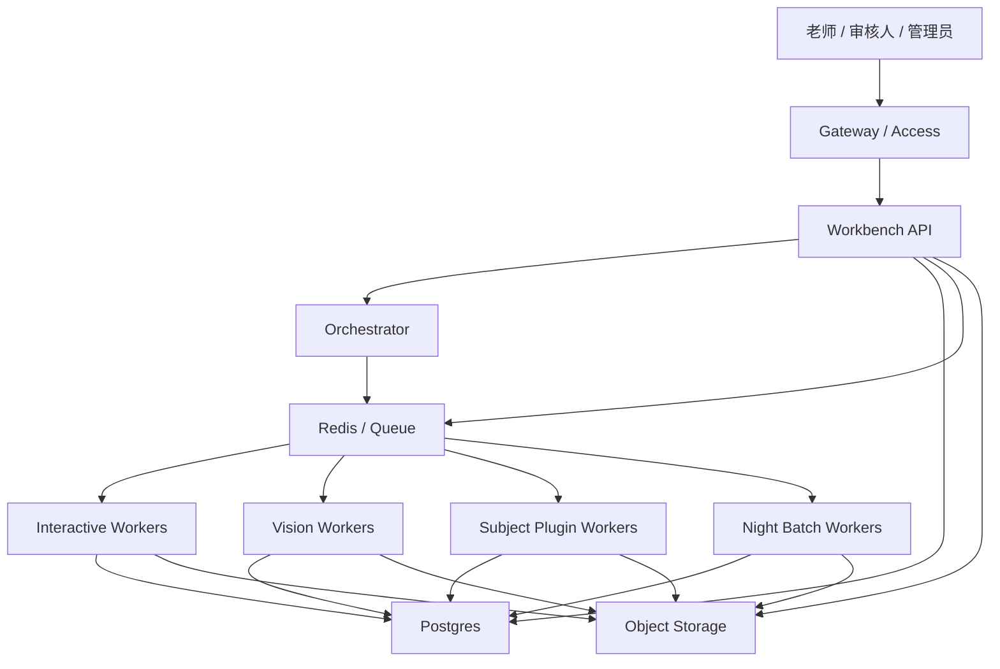
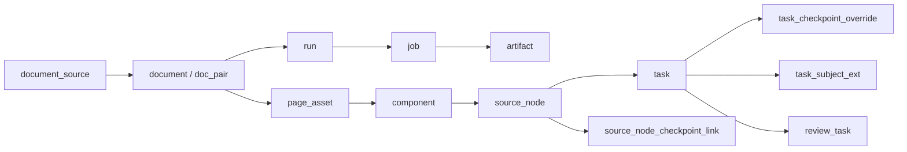
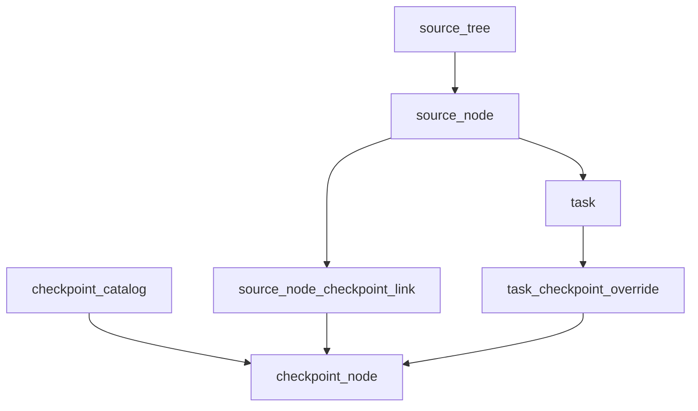
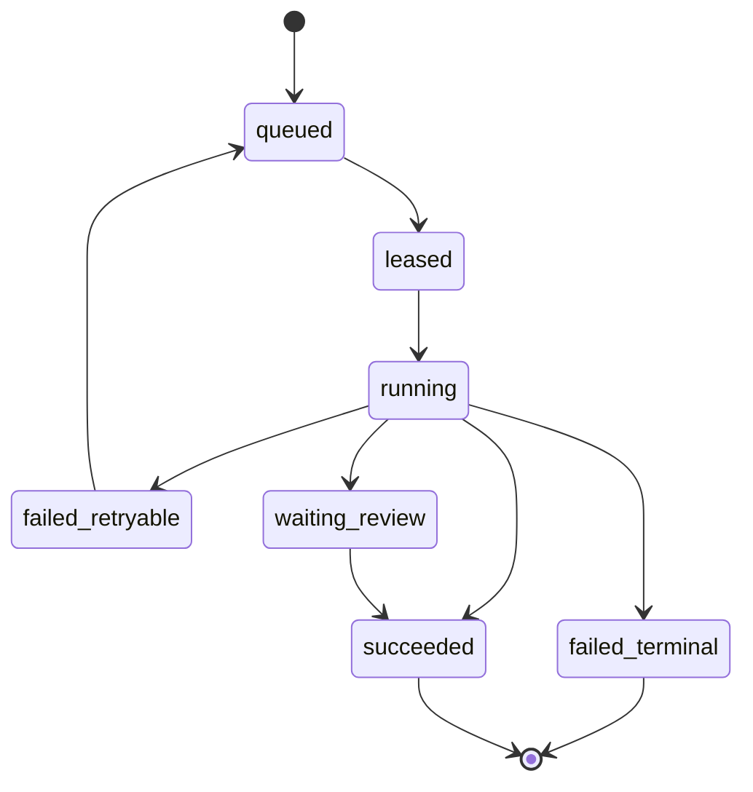
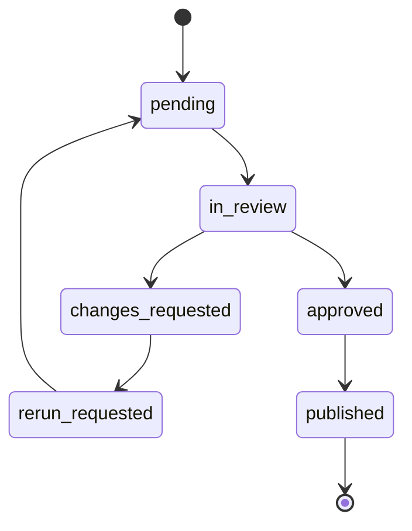

# 后端处理结构设计 v0.2

## 1. 文档目标

这份设计基于 `C:/Users/EDY/Desktop/对话.txt` 中已经收敛出的共识，目标不是一步做成重型微服务，而是为当前阶段设计一套：

- 能接住讲义拆分、视觉处理、题目挂载、考点映射、人工审核的后端主结构
- 能从当前 demo 和脚本体系平滑演进
- 能在后续 `30~50` 人内部使用时继续扩容

当前方案的关键词只有四个：

- `source_tree` 唯一主树
- `artifact-driven` 产物驱动
- `single control plane + distributed workers`
- `day/night dual lanes`

## 2. 当前阶段的核心判断

### 2.1 不做什么

- 不把系统直接做成重型微服务集群
- 不把所有学科字段塞进一张超宽大表
- 不把考点树当成第二棵主树去抢题目的物理归属
- 不让工作台直接挂在整条 OCR/视觉长链路上
- 不在早期就做学科分库、分片、分布式数据库

### 2.2 先做什么

- 用 `source_tree` 固定讲义导入后的 canonical structure
- 用 `checkpoint` 作为语义映射层，而不是物理挂题层
- 用 `run / job / artifact` 串起后端处理链
- 用队列把白天交互与夜间重处理分车道
- 用学科插件协议承接数学、语文、物理等差异

## 3. 与现有项目的衔接

当前仓库里已经有几块能直接复用的基础：

- 公共结构 schema：`C:/Users/EDY/Documents/教研基建/split_builder/schemas/lesson_split.schema.json`
- 课堂结构相位：`C:/Users/EDY/Documents/教研基建/split_builder/config/base_tree.json`
- 运行观测配置：`C:/Users/EDY/Documents/教研基建/config/runtime_observability.yaml`
- Demo 导出接口：`C:/Users/EDY/Documents/教研基建/tools/mock_workbench_api_server.mjs`

结合现状，可以把演进思路定成：

1. 保留当前 `lesson / nodes / tasks / quality` 这层公共内核
2. 增加正式的 `run / job / artifact / checkpoint / review` 领域对象
3. 把现有同步式导出和脚本调用逐步改成队列任务
4. 让工作台只消费“可审核产物”，而不是直接调用底层重处理

## 4. 总体后端结构

### 4.1 设计原则

- 控制面集中：API、权限、任务下发、审核入口统一管理
- 处理面分布：视觉、学科规则、夜间补算由独立 worker 处理
- 数据和文件分治：关系与状态进数据库，重文件进对象存储
- 任务幂等：任何重跑都能定位到 `run` 和 `job`
- 结果可追溯：每一步都沉淀 `artifact`

### 4.2 服务拓扑

### 4.3 各服务职责

#### `Gateway / Access`

- 承接外部访问入口
- 做基础认证、限流和访问隔离
- 早期可继续沿用 Cloudflare 或等价入口层

#### `Workbench API`

- 只处理轻交互
- 提供工作台查询、审核、预览、导出下发、任务状态读取
- 不直接执行 OCR、整本导入、整本重跑

#### `Orchestrator`

- 负责任务编排和状态推进
- 拆分 `run -> jobs`
- 设置优先级、重试、依赖、资源等级
- 控制不同车道并发上限

#### `Redis / Queue`

- 承接异步任务通道
- 维护不同车道的待执行任务
- 保存短期运行态缓存

#### `Interactive Workers`

- 执行白天高优先级轻任务
- 比如局部重跑、节点重组、小范围导出、候选刷新

#### `Vision Workers`

- 执行 OCR、页面切图、组件切分、整本讲义视觉分析
- 独立占用高内存资源
- 避免拖垮工作台接口

#### `Subject Plugin Workers`

- 执行学科规则补全
- 输出学科字段、风险标记、考点候选、能力标签
- 对应“学科插件化”的真正执行面

#### `Night Batch Workers`

- 处理晚间导入、补算、重建、批量导出、历史回填
- 与白天交互组资源隔离

## 5. 核心领域模型

### 5.1 数据对象全景

### 5.2 建议保留的公共主干表

- `document_source`
- `document`
- `doc_pair`
- `run`
- `job`
- `artifact`
- `lesson`
- `source_node`
- `task`
- `asset`
- `review_task`
- `checkpoint_catalog`
- `checkpoint_node`
- `source_node_checkpoint_link`
- `task_checkpoint_override`
- `task_subject_ext`

### 5.3 表职责说明

#### `document_source`

- 标记资料来源
- 区分标准讲义、老师收集题目、临时补充素材

关键字段建议：

- `source_id`
- `source_type`
- `subject`
- `owner_id`
- `import_batch_id`
- `created_at`

#### `document`

- 表示一个原始文档实体
- 可用于教师版、学生版、答案页、零散题集

关键字段建议：

- `document_id`
- `source_id`
- `subject`
- `stage`
- `grade`
- `season`
- `doc_role`
- `storage_uri`
- `page_count`
- `checksum`
- `status`

#### `doc_pair`

- 维护教师版/学生版或讲义/答案的配对关系

关键字段建议：

- `doc_pair_id`
- `student_document_id`
- `teacher_document_id`
- `pair_confidence`
- `pair_source`
- `status`

#### `run`

- 一次完整处理执行
- 比如一次导入、一次重跑、一次导出、一次回填

关键字段建议：

- `run_id`
- `run_type`
- `subject`
- `triggered_by`
- `root_document_id`
- `lane`
- `status`
- `current_job_count`
- `success_job_count`
- `failed_job_count`
- `started_at`
- `finished_at`

#### `job`

- 队列里的最小执行单元
- run 会拆成多个 job

关键字段建议：

- `job_id`
- `run_id`
- `job_type`
- `lane`
- `resource_class`
- `priority`
- `idempotency_key`
- `depends_on_job_id`
- `status`
- `attempt_count`
- `worker_type`
- `payload_ref`
- `result_artifact_id`

#### `artifact`

- 任何阶段的中间产物
- 工作台和下游流程都只消费 artifact，不直接消费长链路执行上下文

关键字段建议：

- `artifact_id`
- `run_id`
- `job_id`
- `artifact_type`
- `version`
- `storage_uri`
- `content_hash`
- `summary_json`
- `quality_status`
- `created_at`

#### `lesson`

- 一份讲义或一次课时的逻辑聚合实体

关键字段建议：

- `lesson_id`
- `doc_pair_id`
- `subject`
- `stage`
- `grade`
- `season`
- `title`
- `source_tree_root_id`
- `quality_gate_status`

#### `source_node`

- `source_tree` 中的节点
- 是唯一主线结构的一部分

关键字段建议：

- `source_node_id`
- `lesson_id`
- `parent_id`
- `node_type`
- `phase`
- `title`
- `order_index`
- `page_start`
- `page_end`
- `component_bundle_ref`
- `visibility`
- `risk_flags`

#### `task`

- 最终题目实体
- 主归属永远挂在 `source_node`

关键字段建议：

- `task_id`
- `lesson_id`
- `source_node_id`
- `question_no`
- `student_stem`
- `teacher_stem`
- `answer`
- `explanation`
- `visibility`
- `difficulty_tier`
- `alignment_status`
- `status`

#### `checkpoint_catalog` 与 `checkpoint_node`

- 表达教研语义目录
- 负责“这题算什么”

关键字段建议：

- `catalog_id`
- `subject`
- `stage`
- `grade_scope`
- `version_no`
- `status`

节点字段建议：

- `checkpoint_node_id`
- `catalog_id`
- `parent_id`
- `code`
- `name`
- `node_kind`
- `order_index`

#### `source_node_checkpoint_link`

- 节点级默认考点继承映射

关键字段建议：

- `link_id`
- `source_node_id`
- `checkpoint_node_id`
- `relation_type`
- `confidence`
- `mapping_source`
- `catalog_version`

#### `task_checkpoint_override`

- 单题局部覆盖
- 只处理例外题

关键字段建议：

- `override_id`
- `task_id`
- `checkpoint_node_id`
- `relation_type`
- `confidence`
- `mapping_source`
- `reason`
- `catalog_version`

#### `task_subject_ext`

- 学科 sidecar 扩展层
- 早期建议先用统一 sidecar 承接

关键字段建议：

- `task_id`
- `subject`
- `plugin_id`
- `schema_version`
- `payload_json`
- `risk_flags`
- `updated_at`

### 5.4 为什么选“公共主干 + sidecar 扩展”

- 比“一张超级大表”更稳
- 比纯 `EAV` 更容易校验、导出和审核
- 公共工作台可以优先消费主干字段
- 学科页再按需读取扩展字段
- 后续高频字段成熟后，可再拆成 `math_task_ext`、`physics_task_ext` 等热点专表

## 6. `source_tree` 与考点映射层

### 6.1 核心原则

- `source_tree` 是系统唯一主树
- `checkpoint` 不是第二棵主树
- 题目的物理归属永远挂 `source_node`
- 考点只做语义解释和投影

### 6.2 推荐结构

### 6.3 工作机制

- 默认先做 `source_node -> checkpoint` 节点级映射
- 同一节点下的题默认继承该映射
- 只有少量特殊题才走 `task -> checkpoint override`

这样可以明显减少老师逐题挂考点的人工量。

### 6.4 版本与发布

考点目录必须支持版本化：

- `draft`
- `published`
- `archived`

建议加“官方基线树 + teacher overlay”机制：

- 官方基线由学科负责人维护
- 老师或项目组可提交局部 overlay
- 发布时选择仅自用或合并入官方版本

## 7. 处理流水线设计

### 7.1 主流水线

### 7.2 每一段要沉淀的产物

- 配对后：`pairing_report`
- OCR 后：`page_ocr_artifact`
- 组件切分后：`component_bundle`
- 结构编排后：`source_tree_snapshot`
- 题目抽取后：`task_bundle`
- 学科补全后：`subject_enrichment_report`
- 考点候选后：`checkpoint_suggestion_bundle`
- 审核后：`reviewed_publishable_bundle`
- 导出后：`export_bundle`

### 7.3 关键好处

- 任何一段失败都可以只重跑该段
- 白天老师消费的是已沉淀的中间产物
- 夜间可以专门跑重构、补算和批量回填

## 8. 调度、队列与状态机

### 8.1 任务车道

- `interactive-light`
- `async-short`
- `async-heavy`
- `night-batch`

### 8.2 资源等级

- `S`：查询、状态刷新、局部写入
- `M`：局部重组、局部导出、节点重跑
- `L`：单课视觉分析、页面 OCR、组件切分
- `XL`：整本讲义导入、批量补算、历史回填

### 8.3 调度原则

- 白天车道优先级高于夜间车道
- `L / XL` 任务必须独立限并发
- 同一 lesson 的重任务要避免并行写入冲突
- 所有任务必须支持幂等重试和断点续跑

### 8.4 `job` 状态机

### 8.5 `review_task` 状态机

## 9. 学科插件协议

### 9.1 插件需要解决的问题

- 学科字段差异
- 学科规则差异
- 考点候选差异
- 风险标注差异
- 导出要求差异

### 9.2 建议的插件清单结构

- `plugin_id`
- `subject`
- `schema_version`
- `supported_job_types`
- `ext_payload_schema`
- `risk_flag_defs`
- `checkpoint_strategy`
- `export_hooks`

### 9.3 插件输入

- `lesson_summary`
- `source_node_snapshot`
- `task_bundle`
- `asset_refs`
- `published_checkpoint_catalog`

### 9.4 插件输出

- `task_subject_ext.payload_json`
- `risk_flags`
- `checkpoint_candidates`
- `quality_notes`
- `export_hints`

### 9.5 为什么要独立 worker

- 不同学科会挂不同规则和提示词
- 处理耗时和资源模型会不一样
- 后续更容易按学科做灰度、评测和扩容

## 10. 存储设计

### 10.1 关系型数据库

推荐 `PostgreSQL` 作为主数据库，负责：

- 元数据
- 状态机
- 审核记录
- 结构树
- 考点映射
- 学科扩展索引

### 10.2 队列与缓存

推荐 `Redis` 负责：

- 任务队列
- 限时锁
- 幂等键
- 短期结果缓存

### 10.3 对象存储

对象存储或独立文件区负责：

- 原始 PDF
- 页图
- 裁片
- OCR 中间结果
- 组件 bundle
- 导出物
- 审核附件

### 10.4 存储边界

- 数据库不存大文件本体
- 工作台读取文件时只拿 `artifact ref / storage uri`
- 所有重文件都通过 `artifact` 追踪版本和质量状态

## 11. 从当前 demo 到正式架构的演进路线

### 11.1 现状

当前项目更接近“单机 demo + 文件产物 + mock API”：

- 工作台前端与导出 API 已可跑通
- 导出 API 仍是同步执行
- 文件型输出多，数据库层尚未进入主流程
- 通用 schema 和工作台雏形已具备

### 11.2 v0.2 第一阶段

- 补 `run / job / artifact` 模型
- 把导入、导出、重跑统一纳入队列
- 明确 `source_tree` 唯一主树
- 把审核流从脚本尾部补丁改成正式主流程节点

### 11.3 v0.2 第二阶段

- 建立 `checkpoint_catalog` 与映射层
- 接入第一批学科插件
- 支持节点继承考点、题目局部覆盖
- 让工作台默认按 `source_tree` 工作

### 11.4 v0.2 第三阶段

- 拆出视觉重处理 worker
- 拆出夜间批处理 worker
- 引入正式对象存储
- 补充观测、告警、重试和回放能力

## 12. 资源建议

### 12.1 开发与小范围测试

适合当前阶段的低成本配置：

- `1 台 4核8G`
- `Postgres + Redis + API + 少量 worker` 同机
- 用于流程验证、demo、`<=5` 人独立测试

这套配置不适合长期混跑整本 OCR 和大规模夜间导入。

### 12.2 最低可上线版

如果准备给小团队内部持续使用，建议至少：

- `1 台控制机`：`8核16G`
- `1 台重处理机`：`16核32G` 或 `16核64G`
- `1 套托管 Postgres`
- `1 套 Redis`
- `对象存储 200GB+`

### 12.3 30~50 人内部稳定版

如果目标是白天 `30~50` 人内部协作、晚上持续跑导入和重算，建议：

- `API / Workbench`：`8核16G`
- `Interactive Worker 池`：`8核16G`
- `Vision / Night Worker 池`：`2 台 16核32G` 起
- `Postgres`：`4~8核 / 16~32G`
- `Redis`：`2~4核 / 4~8G`
- `对象存储`：`500GB~1TB`

瓶颈通常不会先出在普通查询接口，而会先出在：

- OCR
- 整本讲义视觉切分
- 批量导出
- 夜间补算

## 13. 最值得优先落地的三件事

### 13.1 把 `source_tree` 定成唯一主树

这是后面讲义挂题、结构回溯、导出还原的底座，不宜再摇摆。

### 13.2 把 `run / job / artifact` 补齐

没有这一层，系统会一直停留在“脚本串联 + 难重跑 + 难审计”的状态。

### 13.3 把双车道调度定下来

白天交互和夜间重处理不隔离，后面一定会互相拖垮。

## 14. 一句话结论

这套系统当前最合适的后端形态，不是“大一统长线程单机脚本”，也不是“一上来全微服务”，而是：

`单控制面 + artifact 驱动 + source_tree 唯一主树 + checkpoint 语义映射 + 学科插件 worker + 白天/夜间双车道`

这条路线能和你们现有 demo 体系衔接，也能为后面 `30~50` 人规模的内部协作留出清晰扩容路径。
