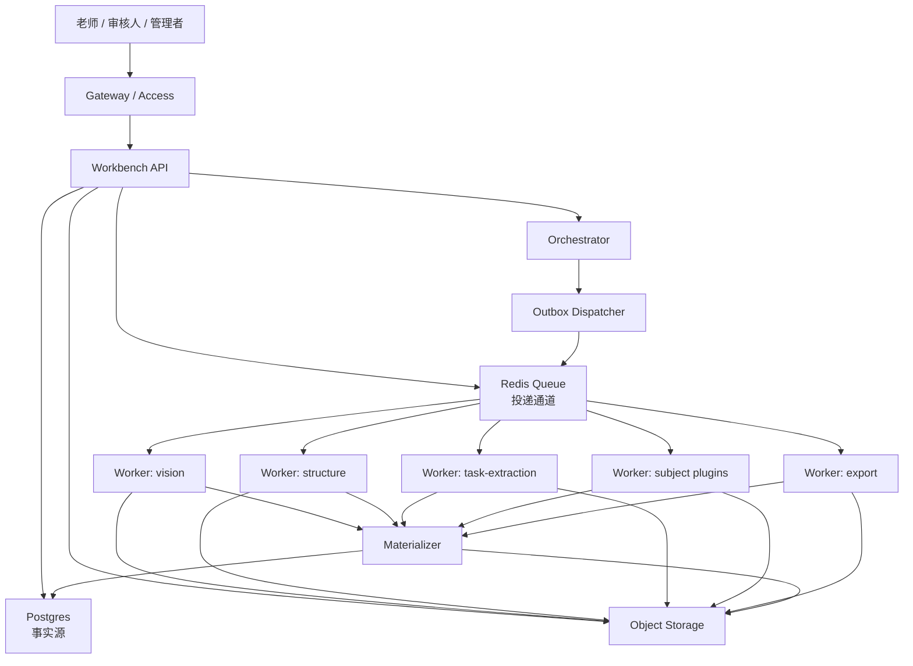
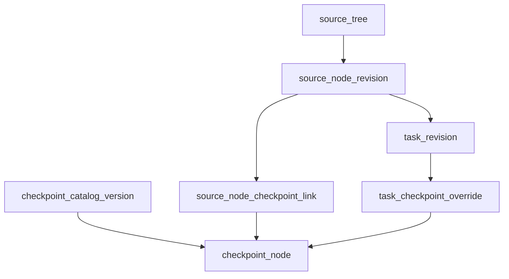
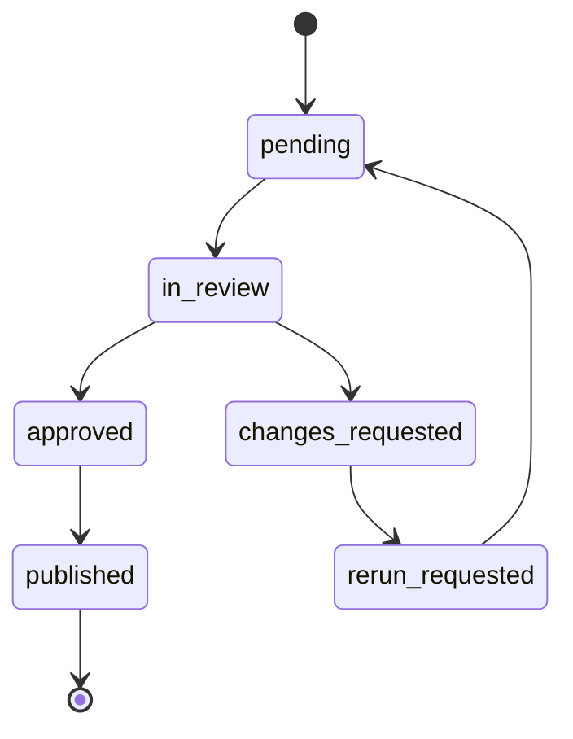

# 后端处理结构设计 v0.3

## 1. 文档目的

这份文档是在 [后端处理结构设计_v0.2](/C:/Users/EDY/Documents/教研基建/后端处理结构设计_v0.2.md) 基础上，吸收 `C:/Users/EDY/Desktop/结论.txt` 的审核意见后形成的修订版。

目标不是把系统一步做成重型微服务，而是先把后续一定会卡住的结构性问题提前补齐，形成一套能从当前 demo 平滑演进的后端蓝图。

本设计配套交付物：

- [后端数据库草案_v0.1.sql](/C:/Users/EDY/Documents/教研基建/后端数据库草案_v0.1.sql:1)
- [后端实施清单_v0.1.md](/C:/Users/EDY/Documents/教研基建/后端实施清单_v0.1.md:1)
- [后端现状汇报_v0.1.md](/C:/Users/EDY/Documents/教研基建/后端现状汇报_v0.1.md:1)

这版文档重点补齐九件事：

- `source_tree / task` 的正式修订模型
- `artifact` 的血缘与生命周期
- `job` 的多依赖与可靠执行机制
- `job` 状态与 `review` 状态彻底分离
- `lane` 与 `capability` 两个维度正交建模
- 学科插件只能产出版本化 artifact，不能任意直写核心表
- `page_asset / component` 的正式落表
- `document_group` 替代单一 `doc_pair` 作为底层文档关系
- `quality_evaluation` 替代单一质量状态位

## 2. 当前共识

### 2.1 继续保留的方向

- `source_tree` 是唯一主树
- `checkpoint` 是语义映射层，不是第二棵主树
- 系统以 `run / job / artifact` 驱动，而不是长线程上下文驱动
- 控制面集中，处理面分布
- 白天交互与夜间重处理分车道
- 学科差异通过插件和扩展层承接，而不是超宽表

### 2.2 这版修订的判断

方向对，但 v0.2 还更偏“蓝图层”。如果不补修订模型、血缘、任务事实源和插件落库边界，后面一旦进入多人审核和反复重跑，很快会出现：

- 已审核内容被机器覆盖
- 导出物无法追溯上游来源
- 夜间重跑和白天审核互相污染
- 学科插件各自修改主表导致一致性变差

## 3. 总体形态

### 3.1 适合当前阶段的落地形态

不是“全微服务”，也不是“单脚本大循环”，而是：

```text
一个代码仓库
├── workbench-api
├── orchestration
├── ingestion
├── source-tree
├── artifact
├── review-publish
├── checkpoint
├── plugin-sdk
└── workers
    ├── vision
    ├── subject
    ├── structure
    └── export
```

部署上可以分进程、分容器，代码上通过模块边界和版本化数据契约实现“半独立”。

### 3.2 总原则

- 模块可以独立生成 `artifact`
- 只有对应领域模块可以修改自己的核心业务表
- 插件不能跨越核心服务直接写主数据
- 数据库是事实源，队列只是投递通道

## 4. 服务拓扑



### 4.1 新增的关键节点

#### `Outbox Dispatcher`

- 解决 `DB 写 job` 和 `Redis 投递消息` 的双写不一致
- `run / job / outbox_event` 在一个数据库事务中完成
- Dispatcher 再把 `outbox_event` 投递到 Redis

#### `Materializer`

- 插件和 worker 只负责生成版本化 artifact
- Materializer 负责校验 schema、校验依赖、事务性落库
- 防止外部能力模块直接改核心表

## 5. 身份、修订与发布模型

### 5.1 为什么必须加修订模型

如果 `lesson / source_node / task` 只保留一份可直接覆盖的数据，后续重跑会产生四类问题：

- 已审核内容被覆盖
- 老审核记录失去定位目标
- 无法比较重跑前后的结构差异
- 发布结果和工作中间态混在一起

### 5.2 核心区分

- `logical_id`：稳定业务身份
- `revision_id`：某次具体版本
- `generated_data`：机器生成内容
- `manual_patch`：人工修订内容
- `published_view`：正式对外使用的发布快照

### 5.3 建议模型

#### `lesson`

- `lesson_id`
- `subject`
- `title`
- `active_revision_id`
- `published_revision_id`
- `status`

#### `lesson_revision`

- `lesson_revision_id`
- `lesson_id`
- `base_artifact_id`
- `generated_snapshot_ref`
- `manual_patch_ref`
- `merged_snapshot_ref`
- `revision_no`
- `status`
- `created_by`
- `created_at`

#### `source_node`

- `source_node_id`
- `lesson_id`
- `stable_code`
- `current_revision_id`

#### `source_node_revision`

- `source_node_revision_id`
- `source_node_id`
- `lesson_revision_id`
- `parent_node_revision_id`
- `node_type`
- `phase`
- `title`
- `order_index`
- `page_span`
- `component_bundle_ref`
- `generated_data_ref`
- `manual_patch_ref`
- `merged_data_ref`
- `status`

#### `task`

- `task_id`
- `lesson_id`
- `stable_question_no`
- `current_revision_id`

#### `task_revision`

- `task_revision_id`
- `task_id`
- `lesson_revision_id`
- `source_node_revision_id`
- `student_stem`
- `teacher_stem`
- `answer`
- `explanation`
- `visibility`
- `generated_data_ref`
- `manual_patch_ref`
- `merged_data_ref`
- `status`

### 5.4 发布语义

- `draft`：工作中版本
- `reviewing`：待审核版本
- `published`：正式版本
- `superseded`：被后续版本替代
- `archived`：历史保留版本

## 6. 文档关系模型

### 6.1 为什么底层不能只用 `doc_pair`

真实场景很可能同时出现：

- 学生版
- 教师版
- 答案册
- 补充讲义
- 分册
- 修订版

因此 `doc_pair` 适合作为常见投影视图，不适合作为唯一底层关系。

### 6.2 建议模型

#### `document`

- `document_id`
- `source_id`
- `subject`
- `stage`
- `grade`
- `season`
- `doc_role`
- `storage_uri`
- `checksum`
- `page_count`
- `status`

#### `document_group`

- `document_group_id`
- `subject`
- `group_type`
- `label`
- `status`

#### `document_group_member`

- `document_group_member_id`
- `document_group_id`
- `document_id`
- `member_role`
- `sort_index`

#### `document_relation`

- `document_relation_id`
- `from_document_id`
- `to_document_id`
- `relation_type`
- `confidence`
- `source`

### 6.3 `doc_pair` 的定位

可以保留一个投影表或视图：

- `doc_pair_view`

用于展示“最常见的学生版/教师版配对”，但不作为底层事实源。

## 7. 视觉组件模型

### 7.1 为什么这层必须正式落表

你们的核心难点不是纯文本，而是：

- 页图
- OCR
- 公式
- 图表
- 组件切分
- 组件复用与结构重组

如果没有稳定的 `page_asset / component` 身份，后面所有重组、复核、回溯都会变得很脆。

### 7.2 建议模型

#### `page_asset`

- `page_asset_id`
- `document_id`
- `page_no`
- `width`
- `height`
- `image_artifact_id`
- `ocr_artifact_id`
- `layout_artifact_id`
- `status`

#### `component`

- `component_id`
- `page_asset_id`
- `parent_component_id`
- `component_type`
- `bbox_json`
- `reading_order`
- `crop_artifact_id`
- `content_hash`
- `schema_version`
- `extraction_confidence`
- `status`

#### `component_link`

- `component_link_id`
- `component_id`
- `target_type`
- `target_revision_id`
- `relation_type`

### 7.3 关键规则

- `task_revision` 引用稳定的 `component_id`
- `source_node_revision` 也引用稳定的 `component_id`
- 不只保存裁片路径
- 组件是可追溯的独立积木，不是临时中间文件

## 8. `source_tree` 与考点语义层

### 8.1 继续保留的结构



### 8.2 推荐表

#### `checkpoint_catalog`

- `catalog_id`
- `subject`
- `scope_type`
- `status`

#### `checkpoint_catalog_version`

- `catalog_version_id`
- `catalog_id`
- `version_no`
- `status`
- `base_version_id`
- `overlay_ref`
- `published_at`

#### `checkpoint_node`

- `checkpoint_node_id`
- `catalog_version_id`
- `parent_id`
- `code`
- `name`
- `node_kind`
- `order_index`

#### `source_node_checkpoint_link`

- `link_id`
- `source_node_revision_id`
- `checkpoint_node_id`
- `relation_type`
- `confidence`
- `mapping_source`

#### `task_checkpoint_override`

- `override_id`
- `task_revision_id`
- `checkpoint_node_id`
- `relation_type`
- `confidence`
- `mapping_source`
- `reason`

### 8.3 工作原则

- 节点默认继承考点
- 少量特殊题走 override
- 发布新考点版本不应悄悄改变老讲义的已发布结果

## 9. Artifact 模型与血缘

### 9.1 仅有产物还不够

系统后面必须能回答：

- 这个导出由哪一版 OCR 产生
- 哪一版结构树参与了生成
- 用了哪个插件版本
- 对应哪个模型和提示词

### 9.2 建议模型

#### `artifact`

- `artifact_id`
- `run_id`
- `job_id`
- `artifact_type`
- `schema_version`
- `producer_name`
- `producer_version`
- `model_version`
- `prompt_hash`
- `plugin_version`
- `storage_uri`
- `content_hash`
- `summary_json`
- `supersedes_artifact_id`
- `lifecycle_status`
- `created_at`

#### `artifact_dependency`

- `artifact_dependency_id`
- `parent_artifact_id`
- `child_artifact_id`
- `dependency_type`

### 9.3 生命周期

- `valid`
- `stale`
- `superseded`
- `archived`
- `deleted`

### 9.4 关键规则

- 上游 artifact 重跑后，下游旧产物应自动标记为 `stale`
- 工作台默认只消费 `valid` 或指定 revision 绑定的 artifact
- 导出物必须可回溯到完整依赖链

## 10. 任务编排与可靠执行

### 10.1 `run`

`run` 是一次业务处理会话，例如：

- 导入讲义
- 局部重跑
- 发布审核
- 批量导出

#### 建议字段

- `run_id`
- `run_type`
- `root_target_type`
- `root_target_id`
- `lane`
- `status`
- `started_at`
- `finished_at`

### 10.2 `job`

#### 建议字段

- `job_id`
- `run_id`
- `job_type`
- `lane`
- `capability`
- `resource_class`
- `priority`
- `idempotency_key`
- `status`
- `attempt_count`
- `max_attempts`
- `lease_expires_at`
- `heartbeat_at`
- `timeout_at`
- `cancel_requested_at`
- `next_retry_at`
- `error_code`
- `error_detail_ref`
- `payload_ref`
- `result_artifact_id`

### 10.3 `job_dependency`

不再只用 `depends_on_job_id`，而是改成多依赖模型：

- `job_dependency_id`
- `upstream_job_id`
- `downstream_job_id`
- `dependency_type`

这样才能表达：

- 多页 OCR 汇聚组件包
- 教师版与学生版处理完成后再对齐
- 结构树、题目包、资源包共同进入学科插件
- 多个质量检查汇聚到发布关口

### 10.4 `outbox_event`

#### 建议字段

- `outbox_event_id`
- `aggregate_type`
- `aggregate_id`
- `event_type`
- `payload_json`
- `status`
- `created_at`
- `dispatched_at`

### 10.5 事实源规则

- `Postgres` 是任务事实源
- `Redis` 只是投递通道
- 不能反过来依赖 Redis 作为唯一事实源

## 11. `job` 与 `review` 状态彻底分离

### 11.1 需要纠正的地方

`job` 不应该长期停在 `waiting_review`。计算任务和人工审核不是同一类生命周期。

### 11.2 `job` 状态机

```mermaid
stateDiagram-v2
    [*] --> queued
    queued --> blocked
    queued --> leased
    leased --> running
    running --> succeeded
    running --> failed_retryable
    running --> failed_terminal
    running --> timed_out
    queued --> cancelled
    failed_retryable --> queued
    failed_terminal --> dead_letter
    timed_out --> queued
    dead_letter --> [*]
    cancelled --> [*]
    succeeded --> [*]
```



### 11.3 `review_task` 状态机



### 11.4 `run` 状态

- `processing`
- `waiting_review`
- `published`
- `failed`

这里的 `waiting_review` 属于 `run` 或发布流程语义，不属于具体 worker job。

## 12. 调度模型：车道与能力分离

### 12.1 为什么要拆成两个维度

“夜间”是调度时段，不是业务处理能力。夜间导入依然会用到视觉、结构、导出和学科插件能力。

### 12.2 `lane`

- `interactive`
- `async-short`
- `async-heavy`
- `night-batch`

### 12.3 `capability`

- `vision`
- `structure`
- `task-extraction`
- `subject.math`
- `subject.chinese`
- `subject.physics`
- `checkpoint`
- `export`

### 12.4 队列示例

- `interactive.general`
- `interactive.subject`
- `batch.vision`
- `batch.structure`
- `batch.subject`
- `batch.export`

### 12.5 Worker 订阅方式

Worker 按 `capability` 订阅队列，调度器按 `lane` 控制优先级和并发上限。

这意味着：

- 晚上不是另一套代码
- 晚上只是调度器对 `batch.*` 队列放宽并发

## 13. 学科插件协议

### 13.1 插件边界

插件遵循固定四步：

1. 读取版本化输入 artifact
2. 在独立进程或容器中处理
3. 产出版本化插件 artifact
4. 由 Materializer 校验并落库

### 13.2 插件不能做的事

- 不能直接写 `lesson_revision`
- 不能直接写 `source_node_revision`
- 不能直接写 `task_revision`
- 不能直接跨模块改主表

### 13.3 建议协议字段

- `plugin_id`
- `subject`
- `plugin_version`
- `input_schema_version`
- `output_schema_version`
- `resource_requirements`
- `timeout`
- `retry_safe`
- `side_effect_free`
- `compatible_core_versions`
- `error_code_defs`

### 13.4 插件产物

- `subject_enrichment_artifact`
- `checkpoint_candidate_artifact`
- `risk_annotation_artifact`
- `export_hint_artifact`

## 14. 质量评估模型

### 14.1 单一质量状态不够

后续必须能回答：

- 是哪条质量规则没过
- 证据是什么
- 使用的是哪套规则版本
- 问题发生在结构、答案、考点还是导出阶段

### 14.2 建议模型

#### `quality_evaluation`

- `quality_evaluation_id`
- `target_type`
- `target_revision_id`
- `rule_set_version`
- `check_code`
- `severity`
- `score`
- `passed`
- `evidence_ref`
- `evaluated_at`

### 14.3 用法

- `lesson_revision` 汇总质量总览
- 具体问题落在 `quality_evaluation`
- 审核界面按规则项展示，不只显示“失败”

## 15. 存储边界

### 15.1 `Postgres`

负责：

- 业务身份
- 修订模型
- 任务事实源
- 血缘索引
- 质量评估
- 审核与发布记录

### 15.2 `Redis`

负责：

- 投递通道
- lease 和短时调度状态
- 短缓存

### 15.3 `Object Storage`

负责：

- 原始 PDF
- 页图
- OCR 结果
- 组件裁片
- 导出物
- 中间 artifact

### 15.4 边界规则

- 主数据库不存大文件本体
- 主表保存引用，不保存长上下文全文
- 一切中间产物统一走 `artifact`

## 16. 基准测试与资源评估

### 16.1 资源不能只按用户数估

真正影响容量的变量是：

- 每天导入多少本
- 每本平均多少页
- 页图分辨率
- OCR 是本地还是外部接口
- 是否运行本地视觉模型
- 单页处理峰值内存
- 中间产物膨胀倍数

### 16.2 上线前必须测的指标

- `pages/hour`
- 单任务峰值 `RSS`
- `P50 / P95` 单页耗时
- 失败率
- 重试率
- 原 PDF 到全部产物的膨胀倍数

### 16.3 推荐基准集

至少拿 `20~30` 份代表性讲义压测，包括：

- 小册子
- 大讲义
- 图表密集型
- 公式密集型
- 多版本文档组

### 16.4 资源建议

如果视觉主要是 CPU OCR，可以继续把：

- `16核 / 32~64GB`

作为重处理机起点。

如果要本地运行较大的视觉模型，还应补：

- `gpu_class`
- `vram_requirement`

不能只靠 `S / M / L / XL` 业务大小描述资源。

## 17. 分阶段落地建议

### 17.1 P0

- 修订模型
- `artifact_dependency` 与生命周期
- `job_dependency`
- `outbox_event`
- `job / review` 状态拆开
- `page_asset / component` 落表
- Materializer 插件落库边界

### 17.2 P1

- `document_group`
- `quality_evaluation`
- worker 能力拆分
- 正式对象存储
- 结构化观测与告警

### 17.3 P2

- overlay 化考点目录
- 更多学科插件
- 灰度发布与自动回滚

## 18. 验收标准

以下测试通过，才可以说“后端真正支撑了需求”：

- 同一个 job 被重复投递两次，只产生一份有效结果
- worker 在处理中被杀死，可以从最近 artifact 继续
- 局部重跑不会覆盖老师已审核的修改
- 新考点目录发布不会悄悄改掉旧讲义已发布结果
- 夜间跑整本 OCR 时，白天工作台查询和审核不明显降级
- 任意导出物都能追溯到输入文档、OCR、结构树、模型、提示词和插件版本
- 两位老师同时修改同一节点时，系统能检测冲突，而不是后写覆盖先写

## 19. 一句话结论

这版结构收束后，系统最合理的后端形态是：

`单控制面 + Postgres 事实源 + Outbox 投递 + Artifact 血缘 + Source Tree 修订模型 + Checkpoint 语义映射 + Capability Worker + Review/Publish 分离`

这样既能和当前 demo 衔接，也把后面一定会炸的几个基础问题提前收住。
