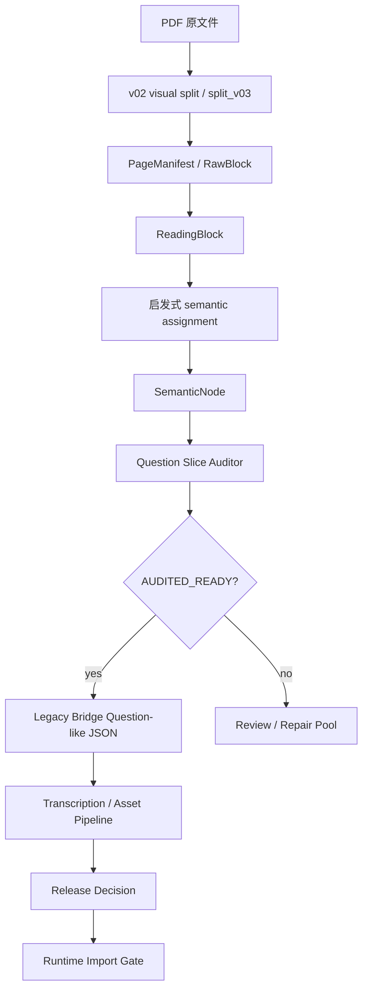
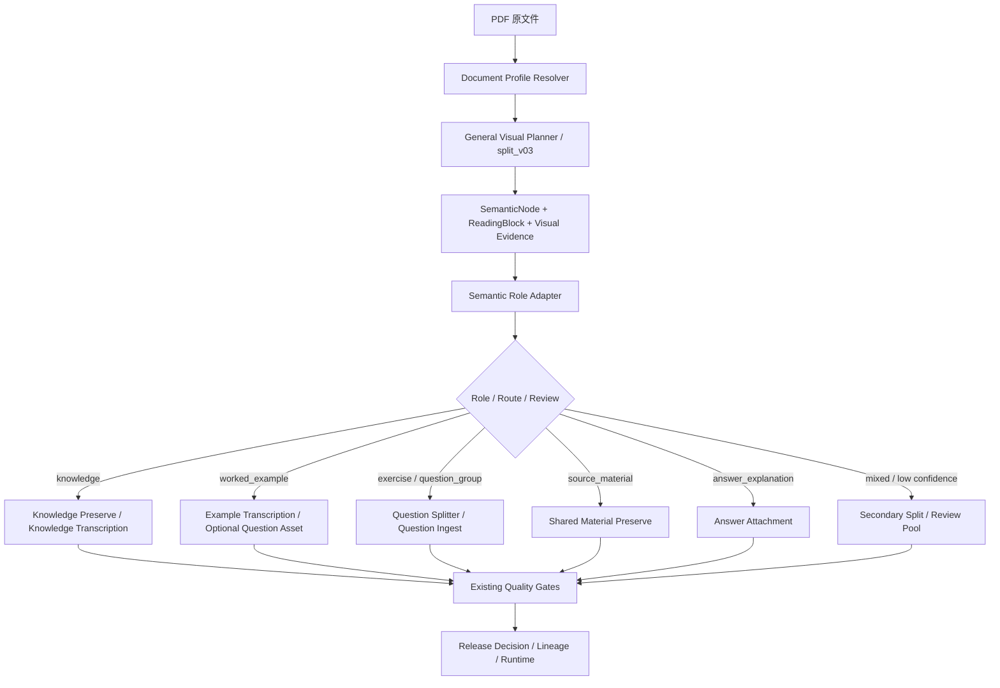
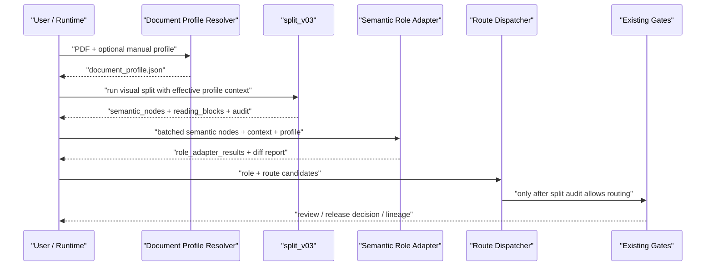
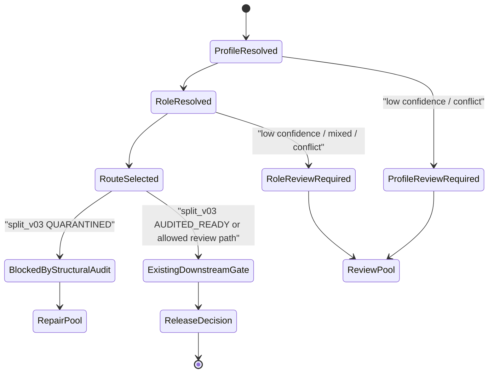
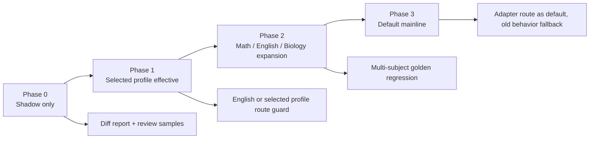

# TeachBase 文档 Profile Resolver 与语义 Role Adapter 设计方案 v0.1

## 1. 文档信息

- 文档名称：文档 Profile Resolver 与语义 Role Adapter 设计方案 v0.2
- 适用分支：`validation/backend-runtime-20260706`
- 输出文件：`docs/semantic_profile_role_adapter_prd_v0.2.md`
- 文档状态：PRD v0.2 / Schema 修订后可进入 Phase 0 Shadow Mode
- 本轮范围：只产出 PRD、数据契约、接入方案、测试方案和实施拆分，不修改运行时代码。
- 核心原则：边界切分以视觉结构为主；在边界已固定的 semantic node 内，业务角色判断以内容功能为主，视觉结构、上下文关系和标题锚点共同辅助。新增语义适配层不得绕过 split_v03、transcription、asset audit、release decision、lineage 和 Runtime 既有门闸。
- 配置原则：内容块类型、语义角色、展示形态、处置策略、route 映射、阈值、提示词版本必须通过 YAML 配置维护，禁止写死在脚本里。

## 2. 背景与现状

TeachBase-Alpha 当前已经具备多条基础链路：

- v02 visual split：按讲义视觉结构、组件、题块生成候选 question slice。
- split_v03：具备页面渲染、block candidate、reading block、semantic node、跨页组装、audit、legacy bridge、repair pool。
- Vision Primary runtime：具备 route planner，在转录阶段选择 `split_text_layer_first`、`split_text_then_visual_supplement`、`vision_primary`。
- question ingest：具备图片需求判断、题内图片候选、资产化、图片合并/精修、资产审核。
- release decision / artifact lineage：具备统一放行门闸与运行时资产血缘。

当前主要问题不是“模型完全看不懂页面”，而是“页面结构切块”和“业务语义角色”混在不同层里：

- visual unit planner 能框出大块，但 role 枚举偏粗，例如英语阅读 p1-2 最近输出 9 个 unit，几乎都归为 `knowledge/noise`。
- `semantic_block_assembler_v03.py` 里存在启发式 role assignment，但函数名仍是 `mock_semantic_assignments_v03`，说明它更像候选归组器，不是正式语义角色适配器。
- v02 已有 `profile`、`unit_kind`、`StructureUnit`、`QuestionSlice`，但其输出仍服务旧切题流程。
- Vision Primary route planner 是文档/转录路由，不是 semantic node 级业务角色判断。
- split_v03 audit 负责结构门闸，不负责把 `worked_example`、`exercise`、`passage_group` 等业务语义稳定分层。

因此，本 PRD 建议新增一层轻量、可回滚、可 shadow 的语义适配能力：

```text
Document Profile Resolver
  -> General Visual Planner / split_v03
  -> Semantic Role Adapter
  -> Specialized Splitter / Transcription Route
```

## 3. 代码审计结论

### 3.1 实际读取和审计过的关键文件

- `tools/run_split_v03_full_doc.py`
- `tools/split_pipeline_v03.py`
- `tools/semantic_block_assembler_v03.py`
- `tools/layout_block_extractor_v03.py`
- `tools/reading_block_builder_v03.py`
- `tools/cross_page_node_accumulator_v03.py`
- `tools/question_slice_auditor_v03.py`
- `tools/split_v03_refine_review_nodes.py`
- `tools/teacher_pdf_visual_runtime_vision_primary.py`
- `tools/teacher_pdf_visual_question_split_v02.py`
- `tools/unit_planner_v01.py`
- `tools/vision_prompt_store.py`
- `tools/run_question_ingest_skill.py`
- `config/teacher_handout_visual_prompts.yaml`
- `config/subject_tracks.json`
- `tests/test_split_v03_contract.py`
- `tests/test_split_v03_coordinate_integrity.py`
- `tests/test_split_v03_golden_cases.py`
- `tests/fixtures/split_v03_golden_cases.yml`
- `tests/release_gate/07_release_decision.test.mjs`
- `tests/release_gate/08_artifact_lineage.test.mjs`
- `tests/release_gate/08_visual_split_adapter.test.mjs`
- `package.json`

### 3.2 近期真实产物参考

- 数学 visual unit planner 探针：
  `outputs/ingress_splitter_v0.1/visual_unit_planner_regression_math_trig_p1_2_20260710/visual_unit_planner_response.json`
  输出 3 个 unit，角色为 `knowledge, knowledge, noise`。

- 英语阅读 visual unit planner 探针：
  `outputs/ingress_splitter_v0.1/visual_unit_planner_regression_reading_mainidea_p1_2_20260710/visual_unit_planner_response.json`
  输出 9 个 unit，角色主要为 `knowledge/noise`。

- 英语写作 visual unit planner 探针：
  `outputs/ingress_splitter_v0.1/visual_unit_planner_probe_help_letter_p1_2_container_v05_20260710/visual_unit_planner_response.json`
  输出 5 个 unit，包含 `knowledge`、`writing_task`、`single_question`、`noise`。

- 完整讲义 split_v03 回归：
  `out/full_handout_regression_20260709/full_math_english_concurrent_20260709/math/full_doc_run_summary.json`
  初始 ready 40、needs_review 11、quarantined 1；精修后 ready 47、needs_review 4、quarantined 1。

- 完整讲义 split_v03 回归：
  `out/full_handout_regression_20260709/full_math_english_concurrent_20260709/english/full_doc_run_summary.json`
  初始 ready 49、needs_review 22；精修后 ready 55、needs_review 15。

### 3.3 当前已实现

- 页面渲染、page manifest、坐标审计：`page_render_adapter_v03.py`、`coordinate_audit_v03.py`。
- RawBlock / ReadingBlock 构建：`layout_block_extractor_v03.py`、`reading_block_builder_v03.py`。
- semantic node 候选组装：`semantic_block_assembler_v03.py`、`cross_page_node_accumulator_v03.py`。
- AUDITED_READY / NEEDS_REVIEW / QUARANTINED 审核：`question_slice_auditor_v03.py`。
- legacy bridge 和 repair pool：`split_pipeline_v03.py`。
- 单候选精修和续片/归属判断：`split_v03_refine_review_nodes.py`。
- v02 profile、unit_kind、question slice、structure unit：`teacher_pdf_visual_question_split_v02.py`。
- open unit planner 雏形：`unit_planner_v01.py`，已有 `semantic_role`、`route`、`child_contract`、`asset_policy` 等规划字段。
- route planner：`teacher_pdf_visual_runtime_vision_primary.py`。
- question ingest、题内图片、资产审核：`run_question_ingest_skill.py`。
- release decision 和 lineage：`build_release_decision.mjs`、`audit_artifact_lineage.mjs` 及 release gate 测试。

### 3.4 当前存在但未统一接入的能力

- v02 的 `unit_kind` 可作为 role evidence，但不能直接替代 `semantic_role`。
- v02 的 `profile` 可作为 document profile 的候选输入，但粒度和枚举不完整。
- split_v03 的 `candidate_flags`、`role_hint`、`review_status` 可作为 role adapter evidence，但不能作为最终业务 role。
- Vision Primary 的 route planner 可作为文档级转录 route evidence，但不应负责 semantic node 级 role。
- visual unit planner probe 的 `semantic_role/route/child_assets` 可作为实验信号，但尚未进入正式 split_v03 主链。
- `unit_planner_v01.py` 证明“单元规划器”接口方向已经存在，但当前主要服务本地 visual unit mock / seed 流程，不能替代基于 assembled semantic node 的正式 role adapter。
- 代码中没有发现稳定的 `panel_kind` 数据字段；当前更接近 v02/unit planner/prompt 中的 `unit_kind`、`table_panel`、`tree_panel`、`mixed_panel` 语义，应作为 layout evidence 或 profile subtype，而不是新建一套顶层 role 状态。

### 3.5 本 PRD 建议新增的能力

- `Document Profile Resolver`：文档级 profile 判断，一份文档原则上只执行一次。
- `Semantic Role Adapter`：以 split_v03 已组装的 semantic node 为主输入，输出 `semantic_role`、`presentation_kind`、`disposition`、profile subtype、route、confidence、evidence、review/fallback。
- Shadow mode 差异报告：对比当前分类、v02 unit_kind、v03 assignment、adapter role 和最终 route。
- Role/route 专项 golden dataset 与业务错送率指标。
- prompt/config version 纳入 lineage/metadata。

### 3.6 本轮明确不做

- 不重构 split_v03。
- 不删除 v02。
- 不修改 Runtime 核心模型或数据库结构。
- 不改变 release decision、artifact lineage 的规则。
- 不实现新的多学科独立 pipeline。
- 不把标题词库硬编码为最终分类规则。
- 不把 PRD 描述为已经上线或生产可自动放行。

## 4. 问题定义

当前链路的结构切块能力和语义路由能力没有稳定分层，导致：

- `exercise -> knowledge`：练习题块被归到知识块，后续不会进入题目拆分。
- `knowledge -> question_splitter`：知识讲解被误送入题目链路，污染题干。
- `answer_explanation` 挂错题：答案/解析跨页或邻近时归属不稳。
- `worked_example` 与 `exercise` 难以区分：例题讲解、典型例析、课堂探究等标题变化时不稳定。
- shared material 缺少稳定表达：英语阅读文章、材料题、实验材料与题组关系不能稳定传递。
- mixed node 无明确处理：一个 semantic node 同时含知识、例题、练习时，既不能直接入库，也不能直接丢弃。

目标不是让 adapter 取代视觉切块，而是让它在结构节点之上给出“业务用途”和“下游路由”。

## 5. 目标与非目标

### 5.1 目标

- 文档级只判断一次 profile，减少重复模型调用。
- 以 semantic node 为主输入判断 role，不逐 raw block 调用模型。
- 保持 `semantic_role` 稳定、克制，学科差异通过 subtype 和配置扩展。
- 输出 role、route、confidence、evidence、review/fallback。
- 与 split_v03 的 AUDITED_READY / NEEDS_REVIEW / QUARANTINED 共存，不覆盖结构门闸。
- 首阶段 shadow mode，不改变当前 route。
- 通过真实数学、英语、生物 golden case 验证。

### 5.2 非目标

- 不解决所有 OCR/转录问题。
- 不直接设计知识库/题库数据库表。
- 不负责最终 release allow/review/block。
- 不把所有学科差异写进一个 prompt。
- 不承诺第一阶段自动生产放行。

## 6. 使用场景

1. 标准数学教师讲义：区分知识梳理、例题、强化训练、课后落实。
2. 英语阅读讲义：区分阅读材料、题组、方法总结、答案解析、翻译。
3. 英语写作讲义：区分审题表格、写作模板、范文、练习任务。
4. 生物讲义：区分知识讲解、实验流程、图解说明、图表题、课后总结。
5. 外部题册/试卷：标题陌生或无标题时，依靠视觉形态和内容功能判断。
6. mixed block：一个节点含知识讲解和题目时，进入二次拆分或 review。

## 7. 当前链路图



## 8. 目标链路图



## 9. Document Profile Resolver 设计

### 9.1 职责

Document Profile Resolver 是文档级节点，一份文档原则上只执行一次。它不负责切块、不负责题目转录、不负责入库放行，只输出该文档的学科、文件类型、内容模式和不确定性。

### 9.2 Schema

```json
{
  "profile_version": "document_profile_v0.2",
  "document_profile_id": "",
  "document_id": "",
  "document_revision_id": "",
  "source_run_id": "",
  "model_profile": {
    "subject": "math|english|biology|mixed|unknown",
    "document_type": "teacher_handout|student_handout|workbook|exam|question_bank_export|reference_material|unknown",
    "content_mode": [
      "knowledge_explanation",
      "worked_examples",
      "exercise_driven",
      "reading",
      "grammar",
      "writing",
      "experiment",
      "diagram_heavy"
    ],
    "stage": "junior|senior|mixed|unknown",
    "language": "zh|en|mixed|unknown",
    "confidence": 0.0
  },
  "manual_override": null,
  "effective_profile": {
    "subject": "math|english|biology|mixed|unknown",
    "document_type": "teacher_handout|student_handout|workbook|exam|question_bank_export|reference_material|unknown",
    "content_mode": [
    "knowledge_explanation",
    "worked_examples",
    "exercise_driven",
    "reading",
    "grammar",
    "writing",
    "experiment",
    "diagram_heavy"
    ],
    "stage": "junior|senior|mixed|unknown",
    "language": "zh|en|mixed|unknown"
  },
  "confidence": 0.0,
  "confidence_source": "model_self_report|calibrated|manual",
  "threshold_version": "uncalibrated_v0.2",
  "evidence": [
    {
      "type": "manual_override|file_path|visual_sample|text_stub|runtime_track|model",
      "detail": "",
      "weight": 0.0
    }
  ],
  "source": "manual_override|model|rule_fallback",
  "profile_conflict": false,
  "needs_profile_review": false,
  "prompt_version": "",
  "config_version": "",
  "created_at": ""
}
```

### 9.3 字段说明

- 必须字段：`profile_version`、`document_profile_id`、`model_profile`、`effective_profile`、`confidence`、`source`、`needs_profile_review`。
- 可空字段：`document_id`、`document_revision_id`、`source_run_id`、`prompt_version`、`config_version`，但进入 lineage 时应补齐。
- `document_profile_id` 建议生成方式：`hash(document_revision_id + profile_version + effective_profile + config_version)`。
- `effective_profile.content_mode` 可以多选，例如英语阅读讲义可同时是 `reading`、`worked_examples`、`exercise_driven`。
- `model_profile` 与 `manual_override` 必须保留，便于解释“为什么最终采用这个 profile”。
- `mixed` 不阻断流程，但会降低 role adapter 的自动路由阈值。
- `unknown` 不阻断视觉切块，但 role adapter 默认更保守，更多进入 `review_only`。

### 9.3.1 Profile Resolver 实际插入位置

Profile Resolver 不应为了判断 profile 重新渲染整份 PDF。推荐物理执行位置：

```text
PDF
-> Preflight
-> 采样页渲染 / 文字层摘要 / page manifest
-> Document Profile Resolver
-> 完整 Visual Planner / split_v03
```

最小输入：

- 文件路径、文件名、目录上下文、可选人工参数。
- preflight 输出：页数、文本层可用性、渲染尺寸、语言/字符粗略统计。
- 采样页：封面/目录附近、前 2 页、后 1 页、随机 1-2 页，复用已生成 page image。
- text stub：每个采样页前若干可读行；若文本层不可用，则使用视觉模型或 OCR 的低成本摘要。

Phase 0 可以在 split_v03 之后 shadow 运行，但正式接入时应放在完整切块前，作为后续 planner 和 adapter 的上下文，不重复渲染。

### 9.4 手工 profile 与模型 profile 冲突

优先级：

1. 显式人工 override。
2. 运行参数/已有 runtime subject track。
3. 模型判断。
4. 规则 fallback。

若人工 override 与模型判断冲突：

- 保留人工 profile 作为 effective profile。
- 将模型结果写入 `evidence`。
- 标记 `profile_conflict=true`，但不阻断。
- 如果冲突影响 route，例如人工指定 math 但模型强判 english，则 `needs_profile_review=true`，role adapter 的自动 route 阈值提高。

### 9.5 与 Runtime subject track 的关系

`config/subject_tracks.json` 已有 Runtime track，例如 `math_junior`、`math_senior`、`english_senior`。Document Profile 不替代 Runtime track：

- Runtime track 解决“进入 Runtime 后属于哪个教学轨道”。
- Document Profile 解决“拆分和语义适配时这份文档应按什么上下文理解”。
- Profile Resolver 可以复用 Runtime track 作为 evidence，但不复制其概念。

## 10. Semantic Role Adapter 设计

### 10.1 关键修正：输入单位以 SemanticNode 为主

Semantic Role Adapter 的主要输入不是逐个 raw visual block，而是 split_v03 或 v02 visual-first 已经完成结构组装后的 semantic node。

推荐主输入：

- `semantic_nodes.json` 或 `semantic_nodes_visual_first_v0.3.json`
- node fragments
- reading block ids 与 reading block text_stub
- visual block ids 与对应 crop/review canvas
- title/text_stub
- 前后相邻节点
- 跨页关系
- shared context 候选，例如 passage、材料、实验背景
- split audit status 与 reasons
- v02 `profile/unit_kind/panel_kind` 或 visual unit planner role 作为 evidence

只有当 node 被判为 `mixed`、`requires_secondary_split=true` 或 `needs_role_review=true` 时，才下钻到 reading block / raw block 级别做二次拆分或人工复核。

### 10.2 Schema

```json
{
  "adapter_version": "semantic_role_adapter_v0.2",
  "source_run_id": "",
  "document_profile_id": "",
  "node_id": "",
  "node_type": "",
  "semantic_role": "knowledge|worked_example|exercise|question_group|source_material|answer_explanation|method_or_strategy|mixed|unknown",
  "presentation_kind": "text|table|diagram|image_text_mixed|formula_heavy|handwritten|unknown",
  "disposition": "processable|noise|review_required|structurally_blocked",
  "profile_subtype": "",
  "functional_description": "",
  "route": "knowledge_transcription|example_transcription|question_splitter|group_splitter|shared_material_preserve|answer_attachment|visual_asset_preserve|secondary_visual_split|review_only|noise",
  "route_availability": "implemented|shadow_only|planned|unavailable",
  "effective_route": "",
  "confidence": 0.0,
  "confidence_source": "model_self_report|calibrated|manual|fallback",
  "threshold_version": "uncalibrated_v0.2",
  "hard_constraints_passed": true,
  "evidence": [
    {
      "type": "visual_structure|content_function|local_anchor|context_relation|existing_assignment|audit_signal",
      "detail": "",
      "weight": 0.0
    }
  ],
  "title_text": "",
  "content_summary": "",
  "shared_context_node_ids": [],
  "relations": [
    {
      "type": "shared_material_for|answers|explains|continues|contains",
      "source_node_id": "",
      "target_node_id": "",
      "confidence": 0.0,
      "evidence": []
    }
  ],
  "requires_secondary_split": false,
  "preserve_as_handout_content": true,
  "eligible_for_question_bank": false,
  "needs_role_review": false,
  "fallback_route": "review_only",
  "prompt_version": "",
  "config_version": "",
  "model": "",
  "created_at": ""
}
```

### 10.3 Canonical semantic_role 枚举

| semantic_role | 定义 | 是否可直接进题库 | 默认 route |
|---|---|---:|---|
| `knowledge` | 概念、知识梳理、背景说明、课前目标、要点回顾 | 否 | `knowledge_transcription` |
| `worked_example` | 已完成例题、带完整讲解的示例、题型示范 | 视产品策略 | `example_transcription` |
| `exercise` | 单题或未解练习，要求学生作答 | 是 | `question_splitter` |
| `question_group` | 同一材料/题组下的多题 | 是，需拆子题 | `group_splitter` |
| `source_material` | 阅读文章、实验材料、公共背景材料 | 否，作为 shared context | `shared_material_preserve` |
| `answer_explanation` | 答案、解析、翻译、详解、参考解 | 否，需挂载 | `answer_attachment` |
| `method_or_strategy` | 方法总结、技巧点拨、解题策略、模板步骤 | 否 | `knowledge_transcription` |
| `mixed` | 同一 node 内含多种功能，不能直接下游 | 否 | `secondary_visual_split` |
| `unknown` | 证据不足，不能判断业务用途 | 否 | `review_only` |

### 10.3.1 presentation_kind 枚举

`presentation_kind` 描述内容如何呈现，不描述业务用途。一个表格练习题应表达为：

```json
{
  "semantic_role": "exercise",
  "presentation_kind": "table",
  "route": "question_splitter"
}
```

| presentation_kind | 定义 |
|---|---|
| `text` | 纯文本或主要文本 |
| `table` | 表格、填表、矩阵化内容 |
| `diagram` | 几何图、函数图、实验图、流程图、树状图 |
| `image_text_mixed` | 图文强混排，不能只靠文本 |
| `formula_heavy` | 大量公式推导或公式面板 |
| `handwritten` | 手写批注/手写过程明显参与内容 |
| `unknown` | 无法稳定判断 |

### 10.3.2 disposition 枚举

`disposition` 描述当前节点如何处置，不描述业务语义。

| disposition | 定义 | 处理 |
|---|---|---|
| `processable` | 可进入对应 route | 受 split audit 和 release gate 约束 |
| `noise` | 页眉、页脚、logo、页码、装饰 | 不进入业务下游 |
| `review_required` | 证据冲突、低置信、关系缺失 | 进入 review / repair |
| `structurally_blocked` | split_v03 结构门闸失败 | 不允许 adapter 拉回自动下游 |

### 10.3.3 节点关系契约

`relations` 是 v0.2 必补字段，用来解决 shared context 和答案挂错题问题。

| relation type | 含义 | 自动路由要求 |
|---|---|---|
| `shared_material_for` | 当前材料服务于一个或多个题目/题组 | target 必须明确，低置信 review |
| `answers` | 当前答案块回答某题 | target 缺失必须 review |
| `explains` | 当前解析/翻译解释某题 | target 缺失必须 review |
| `continues` | 当前 fragment 延续上一节点 | source/target 方向必须明确 |
| `contains` | 当前 node 包含子节点或需要二次拆分 | 默认 secondary split 或 review |

硬约束：

- `semantic_role=answer_explanation` 且没有明确 `relations.target_node_id`，必须 `disposition=review_required`。
- `relations.confidence` 低于答案归属阈值，不能自动进入 `answer_attachment`。
- `split_v03` 非 `AUDITED_READY` 时，即使关系判断高置信，也不能自动 route。

### 10.4 Profile subtype 示例

Subtype 不作为顶层 role 无限扩张，只承载学科和文件类型差异。

数学：

- `geometry_proof_example`
- `algebra_exercise_group`
- `method_summary`
- `formula_table`
- `coordinate_geometry_diagram_question`
- `derivative_worked_example`

英语：

- `reading_passage`
- `passage_question_group`
- `grammar_explanation`
- `grammar_practice`
- `writing_template`
- `sample_answer`
- `sentence_completion_exercise`

生物：

- `experiment_process`
- `diagram_explanation`
- `inheritance_question_group`
- `knowledge_summary`
- `data_chart_question`
- `concept_map`

未知标题材料：

- `unknown_title_exercise_like`
- `unknown_title_knowledge_like`
- `unknown_title_mixed`

### 10.5 Profile subtype 规则

Subtype 的目标是“约束解释方式”，不是“替代 role”。建议规则如下：

| 触发证据 | profile subtype | 影响 |
|---|---|---|
| 数学题号连续、公式/几何图密集、答案解析成组 | `math_exercise_pack` | 默认允许进入 `question_split`，但几何图/长题触发图片与长图旁支 |
| 数学讲解标题、例题完整推导、少量题号 | `math_worked_example_lesson` | `worked_example` 优先，答案解析不应拆成独立题 |
| 英语长篇 passage + 后续多题共享材料 | `english_reading_passage_group` | passage 作为 `shared_context`，后续题挂同一 context |
| 英语写作模板、表格、范文、任务说明 | `english_writing_task_pack` | 表格/模板作为 `knowledge_block` 或 `writing_task`，不能被题号规则切碎 |
| 生物图示、概念讲解、判断/选择混排 | `bio_mixed_lesson_pack` | 强化 `mixed` 检测，低置信进入 secondary split |
| 标题陌生但视觉上像练习题 | `unknown_title_exercise_like` | 不因标题未知降级到 knowledge，但 confidence 上限降低 |
| 标题陌生且知识/题目混排 | `unknown_title_mixed` | 默认 `requires_secondary_split=true` |

## 11. 证据判定原则

Adapter 必须同时考虑三类证据，不允许仅依赖标题。

### 11.1 视觉形态证据

示例：

- 标题区、色块、编号层级。
- 连续题号、选项布局、填空线。
- 大段文章或材料块。
- 表格、树状图、思维导图。
- 红色答案/解析区域。
- 分步讲解、公式推导。
- 与相邻节点的上下文关系。

### 11.2 内容功能证据

判断该块实际在做什么：

- 解释概念。
- 展示完成示例。
- 要求学生作答。
- 提供阅读/实验/图表材料。
- 给出答案或解析。
- 总结方法或模板。

### 11.3 局部锚点证据

锚点只加权，不硬判：

- 中文：例、练、答案、解析、方法、总结、探究、突破、实战、课后。
- 英文：Passage、Task、Choose、Step、Example、Practice、Writing、Summary。

### 11.4 推荐权重

| 证据类型 | 建议权重 | 说明 |
|---|---:|---|
| content_function | 0.40 | 最高优先级，看内容实际用途 |
| visual_structure | 0.30 | 稳定判断材料、题组、表格、答案区 |
| context_relation | 0.20 | 判断 shared context、跨页、答案归属 |
| local_anchor | 0.10 | 标题/关键词，只作为弱证据 |

冲突处理：

- 标题像知识，但内容含连续题号和作答要求：优先 `exercise/question_group`。
- 标题像练习，但内容是答案解析：优先 `answer_explanation`。
- 标题陌生但功能明确：允许自动 role，但 evidence 中必须说明。
- 标题与正文强冲突：`needs_role_review=true` 或 `mixed`。

### 11.5 Confidence / Review 阈值

建议第一阶段保守启用，避免“应 review 却自动路由”。

下表所有数值均为 `initial_thresholds`，不能直接视为上线校准值。Phase 0 必须通过 golden dataset 和人工复核校准后，再冻结到 YAML 配置。模型自报 confidence 只能作为信号，不能覆盖 hard risk。

| 场景 | 自动 route 阈值 | review 阈值 | 处理 |
|---|---:|---:|---|
| 单一清晰题目 / 练习题 | `>=0.82` | `<0.82` | 低于阈值进入 review 或 secondary split |
| 知识讲解 / 模板 / 表格 | `>=0.80` | `<0.80` | 避免误送 question splitter |
| shared context / passage group | `>=0.86` | `<0.86` | 优先保留 context，不急于拆题 |
| answer / analysis / translation 归属 | `>=0.88` | `<0.88` | 归属不清必须 review，防止挂错题 |
| mixed node | 不自动 route | 任意置信 | 进入 secondary split 或 repair pool |
| unknown role | 不自动 route | 任意置信 | 进入 review_only |
| 与 split_v03 audit 冲突 | 不自动 route | 任意置信 | split_v03 结构门闸优先 |

硬约束不受 confidence 覆盖：

- `semantic_role=mixed`：不自动 route。
- `semantic_role=answer_explanation` 且 `relations.target_node_id` 缺失：不自动 route。
- split audit 非 `AUDITED_READY`：不自动 route。
- route 没有真实消费者：不自动 route，`effective_route=review_only`。

## 12. Role 到 Route 映射

Route 是配置枚举，不要求 role 与 route 一一对应。profile 可以覆盖默认 route，但不能绕过 audit/release gate。

| semantic_role | 默认 route | profile 可覆盖 | 进入 question bank |
|---|---|---:|---:|
| `knowledge` | `knowledge_transcription` | 是 | 否 |
| `worked_example` | `example_transcription` | 是 | 可配置 |
| `exercise` | `question_splitter` | 是 | 是 |
| `question_group` | `group_splitter` | 是 | 是，需拆分 |
| `source_material` | `shared_material_preserve` | 是 | 否 |
| `answer_explanation` | `answer_attachment` | 否 | 否 |
| `method_or_strategy` | `knowledge_transcription` | 是 | 否 |
| `mixed` | `secondary_visual_split` | 否 | 否 |
| `unknown` | `review_only` | 否 | 否 |

presentation/disposition 对 route 的影响：

| 条件 | route 调整 |
|---|---|
| `presentation_kind=diagram/table/image_text_mixed` 且 `semantic_role=knowledge` | 保留 `knowledge_transcription`，同时要求 asset preserve |
| `presentation_kind=diagram/table/image_text_mixed` 且 `semantic_role=exercise` | 保留 `question_splitter`，并要求 asset-aware question ingest |
| `disposition=noise` | `effective_route=noise` |
| `disposition=review_required` | `effective_route=review_only` |
| `disposition=structurally_blocked` | `effective_route=review_only` 或 repair pool |

### 12.1 Route 可用性矩阵

Adapter 可以选出理想 route，但只有当前代码有真实消费者时，才允许成为 `effective_route`。

| Route | 当前状态 | 无消费者时的处理 |
|---|---|---|
| `question_splitter` | 已实现 / 部分实现 | 正常进入，但仍受 split audit 和 release gate 约束 |
| `group_splitter` | planned | `effective_route=review_only`，保留原 node |
| `knowledge_transcription` | planned / shadow_only | preserve + review，不送 question ingest |
| `example_transcription` | planned / shadow_only | preserve + review，是否入题库由人工策略决定 |
| `shared_material_preserve` | planned | 保留为 context，不拆成题 |
| `answer_attachment` | planned | relations target 缺失或低置信则 review |
| `visual_asset_preserve` | 已在资产链路部分存在，但不是独立知识消费者 | 只作为 asset policy，不单独 route |
| `secondary_visual_split` | planned | repair pool / review |
| `review_only` | 已存在为 repair/review pool 语义 | 进入 review |
| `noise` | 可过滤 | 不进入业务下游 |

字段要求：

```json
{
  "route": "group_splitter",
  "route_availability": "planned",
  "effective_route": "review_only"
}
```

Route 决策不等于 release decision：

- route 只决定下一步应该进入哪个处理器。
- release decision 继续根据 transcription gate、asset audit、split audit 判断 allow/review/block。
- role adapter 的低置信不会 block 文档，但会让该 node 进入 review 或 secondary split。

## 13. 语义能力重叠处理

### 13.1 `semantic_block_assembler_v03.py`

现状：

- 已有 `BlockAssignmentV03` 和 `role_from_flags()`。
- 当前通过 `candidate_flags` 启发式生成 `question_body`、`answer_block`、`analysis_block`、`translation_block`、`section_heading`、`knowledge_body`。
- 函数名 `mock_semantic_assignments_v03` 表明它是候选装配逻辑。

处理：

- 保留为结构组装和 fallback。
- 其输出作为 adapter 的 `existing_assignment` evidence。
- 不迁移为最终业务 role。
- 若 adapter 失败，允许使用它的结果进入 review，而不是自动 route。

### 13.2 v02 `profile / unit_kind / panel_kind`

现状：

- `teacher_pdf_visual_question_split_v02.py` 有 `resolve_profile()`、`StructureUnit.unit_kind`、`Segment.planner_unit_kind`。
- v02 可输出 `question_candidate` 和 `structure_candidate`。
- 未发现稳定落盘的 `panel_kind` 字段；现有能力更像 `unit_kind` / prompt 中的面板类型信号。

处理：

- `profile` 作为 Document Profile 的 evidence 或 manual override 来源。
- `unit_kind` 作为 Role Adapter evidence。
- 面板类信号迁移为 `layout_evidence.panel_like=true`、`profile_subtype` 或 `asset_policy`，不新增重复 role。
- 不把 `unit_kind` 直接作为 `semantic_role`。
- v02 不删除，作为 fallback 和对照基线。

### 13.3 `unit_planner_v01.py`

现状：

- 已有 `SCHEMA_VERSION = "unit_plan.v0.1"` 和 `PLANNER_VERSION = "open_unit_planner_local_v0.1_visual_first"`。
- 已有 `semantic_role`、`route`、`child_contract`、`asset_policy`、`continuation` 等接近本 PRD 的字段。
- 当前实现主要依赖本地 seed、text hints、unit_kind 推断，适合做开放规划器探针和 mock，不是正式 split_v03 semantic node adapter。

处理：

- 保留为开放 planner 的实验基线和字段参考。
- 复用其 `child_contract`、`asset_policy` 思路，但正式 adapter 的输入必须换成 assembled semantic node + context。
- 其输出进入 shadow diff，不直接覆盖 split_v03 route。
- 如果正式 adapter 无模型可用，可把 `unit_planner_v01.py` 作为 fallback，但 fallback 结果默认 `needs_role_review=true`。

### 13.4 Vision Primary route planner

现状：

- `teacher_pdf_visual_runtime_vision_primary.py` 会基于样本和文本层质量选择转录路线。
- route 为 `split_text_layer_first`、`split_text_then_visual_supplement`、`vision_primary`。

处理：

- 保留为转录阶段 route planner。
- 其 `subject_guess`、`ocr_policy`、`visual_policy` 可作为 document profile evidence。
- 不负责 semantic node 级 role。

### 13.5 split_v03 AUDITED_READY / repair pool

现状：

- `question_slice_auditor_v03.py` 生成 `AUDITED_READY`、`NEEDS_REVIEW`、`QUARANTINED`。
- `split_pipeline_v03.py` 只把 `AUDITED_READY` question 输出到 legacy bridge，其余进入 repair pool。

处理：

- 完整保留，不被 Role Adapter 覆盖。
- Adapter route 必须受 split audit gate 约束。
- `QUARANTINED` 节点不能被 role adapter 直接拉回自动下游，只能提供 repair 建议。

### 13.6 避免重复 role 状态

新增 adapter 不引入新的结构状态，而只引入业务语义字段：

- 结构状态仍然是 `AUDITED_READY / NEEDS_REVIEW / QUARANTINED`。
- 放行状态仍然是 `allow / review / block`。
- adapter 只输出 `semantic_role / presentation_kind / disposition / route / effective_route / needs_role_review / confidence`。
- 不新增“role_ready”作为第三套门闸；role 是否可用由 `needs_role_review=false` 且 `confidence` 达标表示。

## 14. 配置设计

建议新增：

```text
config/semantic_profiles/
  common.yaml
  math.yaml
  english.yaml
  biology.yaml
  document_types.yaml
  content_blocks.yaml
  route_availability.yaml
  thresholds.yaml
```

### 14.1 配置内容

- semantic role 定义。
- content block taxonomy：语义角色、展示形态、处置方式、可选资产策略。
- profile subtype 定义。
- role -> route 默认映射。
- route availability 与 effective route fallback。
- 弱锚点词。
- 禁止硬判规则。
- confidence / review threshold。
- manual profile override。
- prompt/config version。

### 14.1.1 content_blocks.yaml 建议结构

内容块类型必须配置化维护，不能写死在 `semantic_role_adapter.py` 或 planner 脚本里。

```yaml
schema_version: semantic_content_blocks_v0.2

semantic_roles:
  knowledge:
    description: 概念、知识梳理、背景说明、课前目标、要点回顾
    default_route: knowledge_transcription
    eligible_for_question_bank: false
  worked_example:
    description: 已完成例题、题型示范、带完整讲解的示例
    default_route: example_transcription
    eligible_for_question_bank: configurable
  exercise:
    description: 单题或未解练习，要求学生作答
    default_route: question_splitter
    eligible_for_question_bank: true
  question_group:
    description: 同一材料或同一题组下的多题
    default_route: group_splitter
    eligible_for_question_bank: true
  source_material:
    description: 阅读文章、实验材料、公共背景材料
    default_route: shared_material_preserve
    eligible_for_question_bank: false
  answer_explanation:
    description: 答案、解析、翻译、详解、参考解
    default_route: answer_attachment
    eligible_for_question_bank: false
  method_or_strategy:
    description: 方法总结、技巧点拨、模板步骤
    default_route: knowledge_transcription
    eligible_for_question_bank: false
  mixed:
    description: 同一节点内含多种功能
    default_route: secondary_visual_split
    eligible_for_question_bank: false
  unknown:
    description: 证据不足
    default_route: review_only
    eligible_for_question_bank: false

presentation_kinds:
  text: {}
  table: {}
  diagram: {}
  image_text_mixed: {}
  formula_heavy: {}
  handwritten: {}
  unknown: {}

dispositions:
  processable: {}
  noise: {}
  review_required: {}
  structurally_blocked: {}

relation_types:
  shared_material_for: {}
  answers: {}
  explains: {}
  continues: {}
  contains: {}
```

代码只允许：

- 读取 YAML。
- 校验 schema。
- 将模型输出映射到 YAML 中声明的枚举。
- 当 YAML 未声明某值时，降级为 `unknown/review_required`。

代码禁止：

- 在脚本内新增业务 role。
- 在脚本内硬编码“课程目标/要点回顾/强化训练”等具体标题作为唯一判断依据。
- 用 YAML 关键词规则替代模型对 semantic node 的语义判断。

### 14.2 放配置 vs 放代码

放配置：

- 枚举定义。
- 内容块 taxonomy。
- 默认 route。
- 学科 subtype。
- 弱锚点词。
- 阈值。
- prompt 版本。

放代码：

- schema 校验。
- evidence 加权框架。
- route fallback。
- lineage 写入。
- audit gate 约束。
- batch/caching 策略。

禁止：

- 把每个出版社标题逐条写死。
- 用 YAML 关键词匹配替代模型判断。
- 配置膨胀成不可维护规则库。

## 15. Prompt 与 lineage

所有模型相关输出必须写入：

```json
{
  "prompt_version": "semantic_role_adapter_v0.2",
  "config_version": "semantic_profiles_v0.2",
  "model": "doubao-seed-2-0-lite-260428",
  "input_node_ids": [],
  "source_run_id": "",
  "created_at": ""
}
```

Lineage 传递建议：

- Document Profile 输出写入 `document_profile.json`。
- Role Adapter 输出写入 `semantic_role_adapter_results.json`。
- legacy bridge question 增加 `role_adapter` 引用字段。
- release decision 不改变规则，但可在 lineage/evidence 中携带 role adapter 版本。
- Runtime import 不因 role adapter 结果直接 allow。

## 16. Shadow Mode

Phase 0 必须先 shadow，不改变当前 route。

### 16.1 输入

- split_v03 `semantic_nodes.json`
- split_v03 `reading_blocks.json`
- split_v03 `audit_report.json`
- v02 `semantic_nodes_visual_first_v0.3.json`
- visual unit planner response
- current bridge/review pool
- Document Profile

### 16.2 输出

```text
semantic_role_adapter_results.json
semantic_role_adapter_diff_report.json
semantic_role_adapter_review_samples.html
semantic_role_adapter_metrics.json
```

### 16.3 差异报告必须包含

- 当前 node_type / role_hint / unit_kind。
- adapter semantic_role / presentation_kind / disposition。
- adapter route。
- 是否改变下游 route。
- hard misroute 风险。
- 需要人工复核样例。

### 16.4 Shadow 验收

- 不改变 legacy bridge 输出。
- 不改变 release decision。
- 能生成误路由清单。
- 能定位 `exercise -> knowledge` 和 `knowledge -> question_splitter` 风险。

## 17. Profile Resolver + Role Adapter 时序图



## 18. Role / Route / Review 状态流转



## 19. 分阶段迁移图



## 20. 混合、未知、冲突处理

### 20.1 Mixed node

进入 `mixed` 的条件：

- 同一 node 同时包含知识讲解和多个题号。
- 同一 node 同时包含 reading passage 和多题，但未建立 shared context。
- 标题为知识，正文是题组；或标题为练习，正文是答案解析。
- adapter 内部 evidence 高冲突。

处理：

- `requires_secondary_split=true`
- route=`secondary_visual_split`
- 下钻到 reading block 或 visual fragment，不从 raw block 直接开始。
- secondary split 后重新进入 adapter。

### 20.2 Unknown

处理：

- 若结构门闸通过但 role 低置信，route=`review_only`。
- 不阻断整份文档。
- 进入 shadow diff 和人工复核样例。

### 20.3 Conflict

处理：

- 保留所有冲突 evidence。
- 若冲突涉及自动入题库风险，则 `needs_role_review=true`。
- 若冲突只影响知识 subtype，不影响是否入题库，可 route 到保守 `knowledge_transcription`。

## 21. 模型调用粒度、缓存与成本

### 21.1 推荐调用粒度

不逐 raw block 调用。推荐：

- Document Profile Resolver：每份文档 1 次。
- Role Adapter：按相邻 semantic nodes 批量调用，每批 8-15 个 node。
- 对跨页、shared context、mixed、低置信 node 可单独二次调用。
- 对 `AUDITED_READY` 且已有强 evidence 的简单数学单题，可跳过模型或只走轻量 adapter。

### 21.2 输入上下文

每个 node 输入：

- node_id、node_type、review_status、fragments。
- text_stub/title_text/content_summary。
- reading block 摘要，不上传所有 OCR 行。
- 低分辨率 review canvas 或局部 crop。
- 前后各 1-2 个相邻 node 摘要。
- shared context 候选。
- document profile。

### 21.3 缓存

缓存 key：

```text
document_revision_id
+ profile_version
+ adapter_version
+ prompt_version
+ config_version
+ node_id
+ node_fragment_hash
+ context_node_ids_hash
```

### 21.4 成本阶段

第一阶段最小调用：

- profile 每文档 1 次。
- adapter 只对 `NEEDS_REVIEW`、`mixed suspect`、`english/biology` 的结构节点调用。
- 数学稳定题先 shadow，不改变 route。

第二阶段质量优先：

- 对所有 semantic node 批量调用 adapter。
- 对 shared context、answer attachment、跨页节点补充局部视觉证据。

批量生产：

- 文档 profile 缓存。
- 对低风险同模板讲义复用 profile。
- 对 adapter 输出高置信且结构相似的 node 做批处理。
- 模型失败时 fallback 到现有 assignment + review，不自动放行。

## 22. 测试与 Golden Dataset

### 22.1 测试样本

必须使用真实 PDF / 真实页面产物，不只 mock JSON。

数学：

- 知识讲解。
- 完整例题。
- 未解练习。
- 证明题。
- 连续题组。
- 跨页题。
- 图表/公式面板。
- 陌生标题：典型例析、课堂探究、题型突破。

英语：

- 阅读文章。
- 阅读题组。
- 语法讲解。
- 语法练习。
- 方法总结。
- 写作模板。
- 范文。
- 陌生标题：能力提升、实战演练、技巧点拨。

生物：

- 知识讲解。
- 实验流程。
- 遗传图解。
- 曲线图。
- 图表题。
- 连续选择题。
- 课后总结。

文件类型：

- 教师版讲义。
- 学生版讲义。
- 题册。
- 试卷。
- 外部下载材料。
- 无标准标题材料。

### 22.2 必测情况

1. 标题明确且正文一致。
2. 标题陌生但功能明确。
3. 无标题。
4. 标题误导。
5. 同一材料下多个题。
6. 知识讲解后接例题。
7. 例题后接未解练习。
8. 答案与题目跨页。
9. mixed block。
10. profile 判断错误或低置信。

### 22.3 核心指标

重点不是普通 accuracy，而是业务错送率：

- `exercise -> knowledge` 错判率。
- `knowledge -> question_splitter` 错送率。
- `answer_explanation` 挂错题率。
- 应 review 却自动 route 的比例。
- 标题变化后的鲁棒性。
- 跨学科污染率。
- mixed node review recall。
- shared context 归属正确率。
- role adapter 调用次数 / 单文档成本 / 单文档耗时。

### 22.4 建议测试文件

新增：

```text
tests/fixtures/semantic_role_adapter_golden.yml
tests/test_document_profile_resolver_contract.py
tests/test_semantic_role_adapter_contract.py
tests/test_semantic_role_adapter_golden_cases.py
tests/test_semantic_role_adapter_shadow_diff.py
```

release gate 侧不新增放行规则，只增加 lineage/metadata 兼容检查。

### 22.5 Golden Dataset 标注协议

Shadow diff 只能说明新旧结果不同，不能说明谁是对的。因此 golden fixture 必须显式标注四类真值：

```json
{
  "case_id": "",
  "source_document_id": "",
  "page_range": [1, 2],
  "node_id": "",
  "expected_semantic_role": "exercise",
  "expected_presentation_kind": "text",
  "expected_disposition": "processable",
  "expected_route": "question_splitter",
  "expected_relations": [
    {
      "type": "answers",
      "source_node_id": "answer_001",
      "target_node_id": "question_001"
    }
  ],
  "expected_review_required": false,
  "boundary_quality": "correct|overcut|undercut|mixed|unknown",
  "error_scope": "none|boundary_error|role_error|relation_error|route_error|upstream_split_error"
}
```

评分原则：

- 如果上游 node 已经切错，Role Adapter 不应被按 role 错误扣分，应记为 `upstream_split_error`。
- 如果 role 正确但 `relations` 错，按关系错误统计，重点进入答案挂错题指标。
- 如果 route 没有消费者，adapter 选出 planned route 不算错，但 `effective_route` 必须回退到 `review_only`。
- 对知识/练习混合块，若未进入 `mixed` 或 `review_required`，按应 review 却自动路由错误统计。

## 23. 可观测性与产物

建议新增产物：

```text
document_profile.json
semantic_role_adapter_results.json
semantic_role_adapter_diff_report.json
semantic_role_adapter_metrics.json
semantic_role_adapter_review_samples.html
semantic_role_adapter_prompt_trace.json
```

Metrics 示例：

```json
{
  "schema": "semantic_role_adapter_metrics_v0.1",
  "document_id": "",
  "node_count": 0,
  "adapter_called_node_count": 0,
  "cache_hit_count": 0,
  "role_counts": {},
  "route_counts": {},
  "needs_role_review_count": 0,
  "mixed_count": 0,
  "conflict_count": 0,
  "hard_misroute_candidates": [],
  "model_usage": {
    "calls": 0,
    "input_tokens": 0,
    "output_tokens": 0,
    "latency_seconds": 0
  }
}
```

## 24. 接入点

### 24.1 split_v03 接入

建议在 `run_split_v03_full_doc.py` 生成 `semantic_nodes.json` 和 `audit_report.json` 后插入 shadow adapter：

```text
semantic_nodes.json
+ reading_blocks.json
+ audit_report.json
+ document_profile.json
-> semantic_role_adapter_results.json
```

Phase 0 不改变 `legacy_bridge_questions.json`。

### 24.2 v02 接入

v02 输出 `semantic_nodes_visual_first_v0.3.json`、`visual_blocks_v0.3.json`、`reading_blocks_v0.3.json`。Adapter 可读取这些作为输入，但不让 v02 `unit_kind` 直接决定最终 route。

### 24.3 Vision Primary 接入

route planner 保留，新增输入：

- effective document profile。
- adapter route summary。
- role review 风险。

但它不替代 adapter，也不覆盖 split audit。

### 24.4 Question ingest 接入

question ingest 只消费已被 route 到题目链路的节点。对于 `knowledge`、`method_or_strategy`、`source_material`，不得伪装为 question source。

### 24.5 Release decision / lineage 接入

release decision 不改变规则。Adapter 输出只进入 lineage/evidence：

- `document_profile_id`
- `adapter_version`
- `semantic_role`
- `presentation_kind`
- `disposition`
- `route`
- `prompt_version`
- `config_version`

## 25. 兼容与回滚

### 25.1 实施前备份门禁

本 PRD 本轮不修改运行时代码。后续进入 Phase 0 开发前，必须完成以下备份门禁：

- 创建独立开发分支，禁止直接在当前稳定分支上试验。
- 对将修改的文件生成备份清单，至少包含：`run_split_v03_full_doc.py`、`split_pipeline_v03.py`、`semantic_block_assembler_v03.py`、`teacher_pdf_visual_question_split_v02.py`、`vision_prompt_store.py`、`teacher_handout_visual_prompts.yaml`。
- 对现有可用回归产物保留原目录，不用新 run 覆盖旧 run。
- 新增 adapter 只能新增输出文件，Phase 0 不覆盖 `legacy_bridge_questions.json`、`review_repair_pool.json`、`semantic_nodes.json`。
- 每次代码改动必须能通过开关回退：关闭 adapter 后旧链路输出与改动前一致。

### 25.2 分阶段回滚策略

Phase 0：

- 开关：`SEMANTIC_ROLE_ADAPTER_SHADOW=1`
- 只生成 adapter 结果。
- 不影响 legacy bridge。
- 回滚：删除或忽略 adapter 输出。

Phase 1：

- 开关：`SEMANTIC_ROLE_ADAPTER_EFFECTIVE_PROFILES=english_senior_writing,english_senior_reading`
- 仅指定 profile 的 selected route 生效。
- 其他学科继续旧链路。

Phase 2：

- 数学、英语、生物统一使用 adapter，但 `needs_role_review=true` 不自动下游。

Phase 3：

- adapter route 成为默认 route source。
- 旧 assignment 和 v02 unit_kind 保留为 fallback/evidence。

## 26. 验收标准

PRD 实施后的验收不以“所有节点自动分类”为目标，而以降低错送和可审计为目标。

必须满足：

- Document Profile 每份文档原则上只生成一次。
- Semantic Role Adapter 主要输入为 semantic node，不逐 raw block 重复调用。
- `semantic_role` 枚举稳定且数量克制。
- profile subtype 可扩展学科差异。
- 标题只作为弱证据，不硬判。
- low confidence / mixed / conflict 必须进入 review 或 secondary split。
- 不绕过 split_v03 AUDITED_READY / NEEDS_REVIEW / QUARANTINED。
- 不绕过 transcription / asset / release decision。
- Shadow mode 可输出差异报告和误路由清单。
- prompt/config version 进入 lineage 或可追溯 metadata。
- Golden dataset 覆盖数学、英语、生物、陌生标题、跨页、shared context、mixed。

## 27. 建议修改文件清单

本轮不修改代码。下一轮建议新增/修改：

新增：

- `tools/document_profile_resolver.py`
- `tools/semantic_role_adapter.py`
- `tools/run_semantic_role_adapter_shadow.py`
- `config/semantic_profiles/common.yaml`
- `config/semantic_profiles/math.yaml`
- `config/semantic_profiles/english.yaml`
- `config/semantic_profiles/biology.yaml`
- `config/semantic_profiles/document_types.yaml`
- `tests/fixtures/semantic_role_adapter_golden.yml`
- `tests/test_document_profile_resolver_contract.py`
- `tests/test_semantic_role_adapter_contract.py`
- `tests/test_semantic_role_adapter_golden_cases.py`
- `tests/test_semantic_role_adapter_shadow_diff.py`

修改：

- `tools/run_split_v03_full_doc.py`：Phase 0 shadow 接入。
- `tools/teacher_pdf_visual_question_split_v02.py`：输出 profile/unit_kind evidence 到统一格式。
- `tools/vision_prompt_store.py`：新增 profile/adapter prompt bundle，仍从 YAML 读取。
- `config/teacher_handout_visual_prompts.yaml`：新增 prompt，不在脚本内写提示词。
- `tools/teacher_pdf_visual_runtime_vision_primary.py`：只读取 adapter summary，不让 route planner 覆盖 adapter。
- `tools/run_question_ingest_skill.py`：只接受 route 到题目链路的 source。

## 28. 分阶段实施任务清单

### Phase 0：Shadow only

1. 新增 Document Profile schema 与本地 resolver stub。
2. 新增 Semantic Role Adapter schema validator。
3. 新增 shadow runner，读取现有 semantic nodes。
4. 新增 diff report。
5. 新增 golden fixture。
6. 不改变 legacy bridge。

### Phase 1：英语指定 profile 生效

1. 只对英语阅读/写作打开 adapter route。
2. 检查 `exercise -> knowledge` 错判率。
3. 检查 passage shared context。
4. 检查答案/解析挂载。
5. 人工审核样例后再扩大。

### Phase 2：多学科扩大

1. 数学、生物纳入 adapter。
2. subtype 配置扩展。
3. mixed node 二次拆分。
4. 加入成本缓存。

### Phase 3：默认主线

1. adapter route 成为默认 route source。
2. 旧 assignment 降级为 fallback/evidence。
3. 将 adapter 结果接入 lineage。
4. release gate 继续作为唯一自动入库依据。

## 29. 风险

- 模型 role 判断可能受标题诱导，需要强制 evidence 分层和标题弱证据策略。
- 如果 semantic node 本身切错，adapter 只能判断“这是 mixed/needs review”，不能凭空修复边界。
- 如果全部 node 都调用模型，成本会升高，必须批处理和缓存。
- 如果 route 提前生效，可能污染下游；必须先 shadow。
- 如果新增状态过多，会与 split audit/release decision 冲突；因此不新增第三套 readiness 状态。

## 30. 待人工决策项

1. `worked_example` 是否允许进入题库，还是默认保留为讲义内容。
2. Phase 1 首个 effective profile 选英语阅读、英语写作，还是数学例题。
3. mixed node 二次拆分后，是否允许自动回流题目链路，还是必须人工 review 一轮。
4. Profile manual override 的 UI/配置入口放在运行参数、JSON manifest，还是 Runtime 页面。
5. 成本上限：单份讲义 role adapter 最大模型调用次数和最大耗时阈值。
